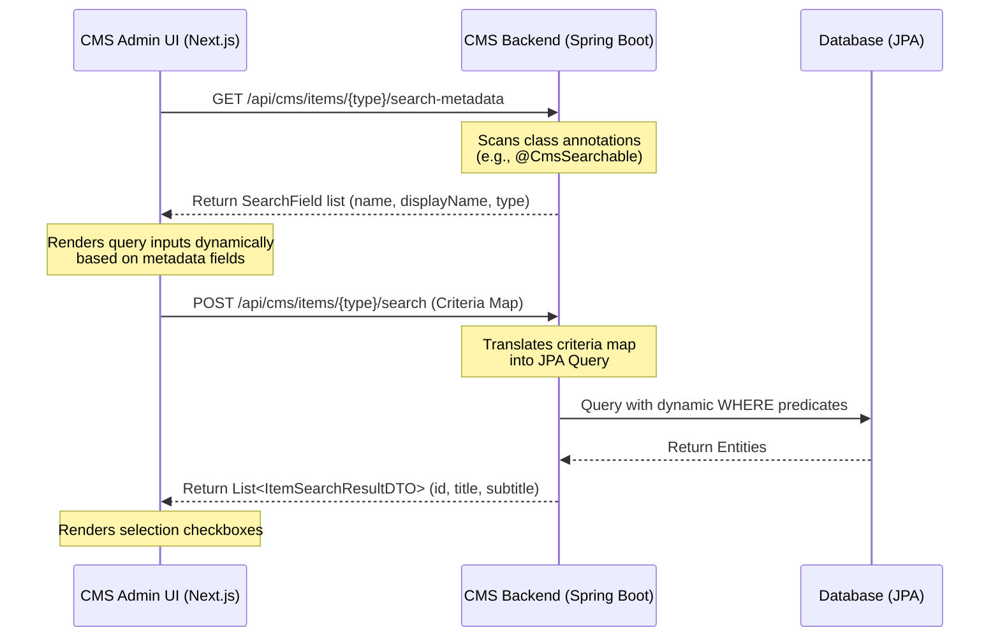

## Table of Contents
{: .no_toc}

* TOC
{:toc}

---

## Introduction

In [Part 1 of the Headless CMS case study](/case-studies/headless-cms-demo-runtime-composition), we discussed how we decoupled frontend page structures from backend schemas using slot-based layout engines, two-stage catalog publishing, and topological sync operations. 

While that setup solved page rendering and publishing isolation, a new challenge quickly emerged: **administrative search and item selection**. 

When content editors build landing pages, they frequently need to configure components that link to catalog items—such as a \"Product Carousel\" referencing specific products, a \"Trending Articles\" list referencing editorial content, or a \"Latest Events\" list referencing promotional activities. 

If we hardcode a custom search endpoint and a unique search modal for every new entity type, we create massive UI code duplication and tight coupling. Every new domain model would require:
1. A new backend REST endpoint for filtering.
2. A new frontend API client method.
3. A unique modal component with specialized search inputs and results styling.

To solve this, we implemented an **annotation-driven, generic metadata and search engine**. This system allows the frontend to dynamically query searchable attributes of *any* backend entity and build interactive search filters at runtime, requiring zero frontend code updates when registering new domains.

---

## The Generic Search Workflow

The core idea of this architecture is to treat search schema as metadata. Rather than the storefront admin panel knowing what fields a `Product` or `Article` has, it queries the backend's metadata registry for that entity type. 



By decoupling the search interface from the database schema:
* The backend remains the single source of truth for searchable fields.
* The frontend admin UI resolves input controls dynamically.
* The search execution layer queries the correct database tables polymorphicly.

---

## Backend: Annotation-Driven Metadata

To make a Java entity searchable within the administrative panel, we declare a custom, repeatable `@CmsSearchable` annotation. This maps directly to class-level attributes, identifying the property path, its administrative display name, and its input field type.

### 1. Declaring the Annotations

```java
@Target(ElementType.TYPE)
@Retention(RetentionPolicy.RUNTIME)
@Repeatable(CmsSearchables.class)
public @interface CmsSearchable {
    String name();           // Field path in JPA entity (e.g. "code", "title")
    String displayName();    // Label shown to content editor
    String type() default "string";
}
```

```java
// CmsSearchables.class (Container for Repeatability)

@Target(ElementType.TYPE)
@Retention(RetentionPolicy.RUNTIME)
public @interface CmsSearchables {
    CmsSearchable[] value();
}
```

### 2. Annotating the Entities

Any entity class can register its searchable properties by applying these annotations. For instance, the `Product` entity exposes its catalog code and name:

```java
@Entity
@CmsSearchable(name = "name", displayName = "Product Name", type = "string")
@CmsSearchable(name = "code", displayName = "Product Code", type = "string")
public class Product extends CatalogAwareModel {
    private String code;
    private String name;
    private Double price;
    // Getters and Setters...
}
```

---

## Backend: Schema Reflection & Dynamic Queries

The backend hosts a single administrative search service (`ItemSearchService`) that exposes metadata and runs criteria-based JPA filters.

### 1. Reflecting Search Fields

When the frontend asks for metadata of a type, the service scans the target class definition for the annotations and returns a list of fields:

```java
// ItemSearchService.java (Part 1 - Metadata Extraction)
@Service
@RequiredArgsConstructor
public class ItemSearchService {

    private final EntityManager entityManager;
    private static final Map<String, Class<?>> TYPE_TO_CLASS = Map.of(
        "product", Product.class,
        "article", Article.class,
        "event", Event.class
    );

    public ItemSearchMetadataDTO getSearchMetadata(String type) {
        Class<?> clazz = TYPE_TO_CLASS.get(type.toLowerCase());
        if (clazz == null) return new ItemSearchMetadataDTO(List.of());

        List<SearchField> fields = new ArrayList<>();

        if (clazz.isAnnotationPresent(CmsSearchables.class)) {
            CmsSearchables searchables = clazz.getAnnotation(CmsSearchables.class);
            for (CmsSearchable searchable : searchables.value()) {
                fields.add(new SearchField(searchable.name(), searchable.displayName(), searchable.type()));
            }
        } else if (clazz.isAnnotationPresent(CmsSearchable.class)) {
            CmsSearchable searchable = clazz.getAnnotation(CmsSearchable.class);
            fields.add(new SearchField(searchable.name(), searchable.displayName(), searchable.type()));
        }

        return new ItemSearchMetadataDTO(fields);
    }
}
```

### 2. Executing Dynamic JPA Queries

To search items, the controller accepts a map of field-value criteria (e.g. `{"name": "MacBook", "code": "MBP"}`) and builds a JPQL query dynamically. 

Standardizing the search output structure into a common `ItemSearchResultDTO` allows the frontend UI to display search listings uniformly without knowing the exact database schema:

```java
// ItemSearchService.java (Part 2 - Query Execution)
public List<ItemSearchResultDTO> searchItems(String type, Map<String, String> criteria) {
    Class<?> clazz = TYPE_TO_CLASS.get(type.toLowerCase());
    if (clazz == null) return List.of();

    if (type.equalsIgnoreCase("product")) {
        return searchProducts(criteria);
    }
    // Resolves other entity types similarly...
    return List.of();
}

private List<ItemSearchResultDTO> searchProducts(Map<String, String> criteria) {
    StringBuilder jpql = new StringBuilder("SELECT p FROM Product p WHERE 1=1");
    Map<String, Object> params = new HashMap<>();

    // Map input fields to JPQL queries safely
    if (criteria.containsKey("name") && !criteria.get("name").trim().isEmpty()) {
        jpql.append(" AND LOWER(p.name) LIKE :name");
        params.put("name", "%" + criteria.get("name").trim().toLowerCase() + "%");
    }
    if (criteria.containsKey("code") && !criteria.get("code").trim().isEmpty()) {
        jpql.append(" AND LOWER(p.code) LIKE :code");
        params.put("code", "%" + criteria.get("code").trim().toLowerCase() + "%");
    }

    Query query = entityManager.createQuery(jpql.toString(), Product.class);
    params.forEach(query::setParameter);

    List<Product> products = query.getResultList();
    return products.stream()
            .map(p -> new ItemSearchResultDTO(p.getCode(), p.getName(), p.getCode() + " - $" + p.getPrice()))
            .collect(Collectors.toList());
}
```

> [!IMPORTANT]
> *Key Identifier Design Choice*: Notice that the `ItemSearchResultDTO` mapping returns `p.getCode()` as the identifier for a product, while other types like articles return `String.valueOf(a.getId())`. This is a deliberate choice: in our storefront, products are referenced across subsystems and catalog sync transactions by their unique business codes rather than database auto-incrementing primary keys. The generic search UI accommodates this by treating the returned identifier as an opaque token.

> [!WARNING]
> *Missing Query Pagination*: In this proof-of-concept implementation, `query.getResultList()` is called directly without pagination limits. For production environments, it is critical to invoke `.setMaxResults(limit)` or pass pagination offsets to prevent loading the entire database table into memory when an empty search query is evaluated at form initialization.

---

## Frontend: Dynamic Selection Fields

On the frontend, fields are resolved using a schema-driven form builder. When configuring a component, we use the syntax `multiple_items:itemType` (e.g., `multiple_items:product`) to designate a multi-item selection input, and `item:itemType` (e.g., `item:event`) to designate a single-item selection input.

### 1. Suffix Parsing and Metadata Fetching

During component initialization, the form loader splits the type string to discover the target item domain, queries its metadata, and fetches default items:

```tsx
// page.tsx (Component Editor Initializer)
if (field.type.startsWith('multiple_items:') || field.type.startsWith('item:')) {
  const itemType = field.type.split(':')[1]; // e.g. "product"
  
  // 1. Fetch metadata schema of target entity
  const meta = await cmsApiClient.getSearchMetadata(itemType);
  setSearchMetadata(prev => ({ ...prev, [itemType]: meta.data }));
  
  // 2. Load default items (empty search)
  const res = await cmsApiClient.searchItems(itemType, {});
  setSearchResults(prev => ({ ...prev, [itemType]: res.data }));
}
```

### 2. Rendering Search Filters Dynamically

Because the metadata returns the list of searchable attributes, we iterate over the properties to display custom search query text boxes:

```tsx
// page.tsx (Field Form Renderer - Simplified)
{(field.type.startsWith('multiple_items:') || field.type.startsWith('item:')) && (
  <div className="space-y-2 mt-2">
    {/* 1. Dynamically render search input boxes for each metadata property */}
    {searchMetadata[itemType]?.fields?.map(metaField => (
      <input 
        placeholder={`Search ${metaField.displayName}...`}
        onChange={(e) => updateSearchCriteria(metaField.name, e.target.value)}
        /* ... styling ... */
      />
    ))}
    
    {/* 2. Render Selection List based on search results */}
    <div className="selection-list">
      {searchResults[itemType]?.map(item => {
        const isMultiple = field.type.startsWith('multiple_items:');
        return (
          <label key={item.id}>
            {/* Render Checkbox for 'multiple_items', Radio for 'item' */}
            <input
              type={isMultiple ? "checkbox" : "radio"}
              onChange={() => handleItemSelection(field.name, item.id, isMultiple)}
            />
            <span>{item.title}</span>
          </label>
        );
      })}
    </div>
  </div>
)}
```

With this implementation, the search form inputs and filtering behaviors are generated purely from the annotations retrieved at runtime.

---

## Proof of Extensibility

By isolating domain-specific fields on the backend via annotations and genericizing selection queries, adding a completely new domain type (like `Article` or `Event`) is extremely simple.

### Step 1: Annotating the new Entity on the Backend
To add an `Article` search, we simply declare `@CmsSearchable` annotations on the `Article.java` class:

```java
@Entity
@CmsSearchable(name = "title", displayName = "Article Title", type = "string")
public class Article extends CatalogAwareModel {
    private String title;
    private String body;
    // ...
}
```

### Step 2: Defining the CMS Field on the Component
We define the component's field type using our `multiple_items:itemType` syntax. For example, a `TrendingArticleComponent` is defined with a property `article_ids` of type `multiple_items:article`:

```java
@Entity
public class TrendingArticleComponent extends Component {
    private String title;

    @Column(name = "article_ids")
    @CmsField(displayName = "Articles", type = "multiple_items:article", required = true)
    private String articleIds; 
}
```

Similarly, we can support single-item selection using the `item:itemType` syntax. For instance, a `TopEventComponent` requires only a single event selection:

```java
@Entity
public class TopEventComponent extends Component {
    private String title;

    @Column(name = "event_id")
    @CmsField(displayName = "Event", type = "item:event", required = true)
    private String eventId; 
}
```

### The Result

Without writing any frontend React code, creating custom components, or registering new REST endpoints, the Admin UI automatically:
1. Detects the `multiple_items:article` and `item:event` type tags.
2. Queries the metadata schema at `/api/cms/items/article/search-metadata` and `/api/cms/items/event/search-metadata`.
3. Dynamically renders search text boxes labeled *"Search Article Title..."* based on the returned annotations.
4. Executes searches and intelligently toggles between rendering checkboxes (for `multiple_items`) and radio buttons (for `item`) out of the box.

On the backend, because query generation is not yet fully dynamic, the developer still needs to make two minor additions:
1. Add the `@CmsSearchable` annotations to the new entity class.
2. Register the class mapping in `TYPE_TO_CLASS` and add a query translation method (e.g. `searchArticles()`) in the search service.

---

## Conclusion

By treating search schemas as reflection-based metadata and building dynamic UI forms, we drastically reduced code maintenance overhead. The frontend remains clean, reusable, and decoupled, while the backend controls entity-level schema rules. 

This model allows a Headless CMS to expand rapidly into new domains, ensuring developers can add content models in minutes while offering editors a uniform and intuitive administration experience.

