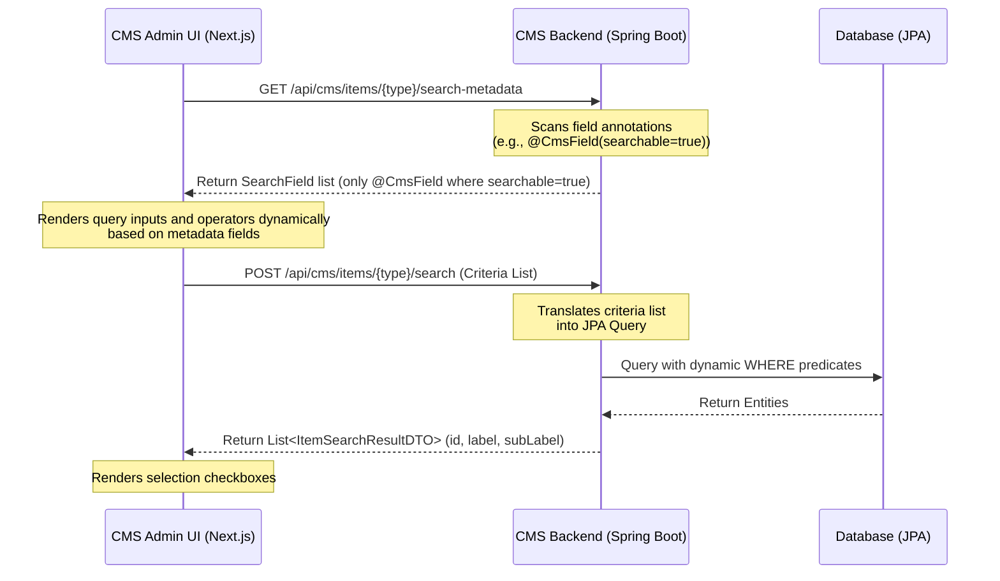

## Table of Contents
{: .no_toc}

* TOC
{:toc}

---

## Introduction

In [Part 1 of the Headless CMS case study](/case-studies/headless-cms-demo-runtime-composition), we discussed how we decoupled frontend page structures from backend schemas using slot-based layout engines, two-stage catalog publishing, and topological sync operations. 

While that setup solved page rendering and publishing isolation, a new challenge quickly emerged: **administrative search and item selection**. 

When content editors build landing pages, they frequently need to configure components that link to catalog items, such as a "Product Carousel" referencing specific products, or a "Trending Articles" list referencing editorial content. 

If we hardcode a custom search endpoint and a unique search modal for every new entity type, we create significant UI code duplication and tight coupling. Every new domain model would require:
1. A new backend REST endpoint for filtering.
2. A new frontend API client method.
3. A unique modal component with specialized search inputs and results styling.

To solve this, we implemented an **annotation-driven metadata registry and dynamic search UI**. This system allows the CMS Admin UI to dynamically discover searchable attributes of registered backend entities and build interactive search filters at runtime, without requiring frontend code changes when registering new domains.

---

## The Generic Search Workflow

The core idea of this architecture is to treat the search schema as metadata. Rather than the CMS Admin UI knowing what fields a `Product` or `Article` has, it queries the backend's metadata registry for that entity type. 



By decoupling the search interface from the database schema:
* The backend remains the single source of truth for searchable fields.
* The frontend admin UI resolves input controls dynamically.
* The search execution layer routes criteria to domain-specific JPA query builders.

---

## Backend: Annotation-Driven Metadata

To make a Java entity searchable within the CMS Admin UI, we declare schema metadata directly on the entity fields using a unified `@CmsField` annotation. By placing `@CmsField` on entity fields and introducing `searchable = true` and `order` attributes, we consolidate UI form rendering and search schema registration into a single source of truth.

### 1. The Unified Field Annotation

```java
@Target(ElementType.FIELD)
@Retention(RetentionPolicy.RUNTIME)
public @interface CmsField {
    String displayName();
    String type() default "string"; // e.g., "string", "text", "boolean", "number"
    boolean required() default false;
    String placeholder() default "";
    boolean searchable() default false;
    int order() default 1;
}
```

### 2. Annotating the Entities

Any entity class can expose its searchable properties to the generic search engine by applying `@CmsField(searchable = true, ...)`. For instance, the `Product` entity exposes its catalog code, name, and price, while ordering them in the search UI:

```java
@Entity
@Table(name = "products")
public class Product extends CatalogAwareModel {

    @CmsField(displayName = "Product Code", searchable = true, order = 1)
    @NotBlank(message = "Product code is required")
    @Column(nullable = false)
    private String code;

    @CmsField(displayName = "Product Name", searchable = true, order = 2)
    @NotBlank(message = "Product name is required")
    @Column(nullable = false)
    private String name;

    @CmsField(displayName = "Price", type = "number", searchable = true, order = 3)
    @NotNull(message = "Price is required")
    @Column(nullable = false, precision = 10, scale = 2)
    private BigDecimal price;

    // Getters and Setters...
}
```

---

## Backend: Schema Reflection & Criteria Routing

Our backend hosts a single administrative search service (`ItemSearchService`) that exposes metadata and runs criteria-based JPA filters.

### 1. Runtime Model Discovery & Metadata Extraction

In this updated architecture, we eliminated manual model registration by relying on JPA's `EntityManager` metamodel. During application startup (`@PostConstruct`), our service inspects all managed JPA entities and automatically registers any class extending `ItemModel` into an in-memory entity registry.

When the frontend requests search metadata for an entity type, our service looks up the domain class, traverses up its inheritance hierarchy (`while (current != null && current != Object.class)`), and inspects declared fields for `@CmsField(searchable = true)`. It then sorts the discovered fields by their `order` attribute:

```java
// ItemSearchService.java (Part 1 - Dynamic Model Discovery & Field Reflection)
@Service
@RequiredArgsConstructor
@Slf4j
public class ItemSearchService {

    private final EntityManager entityManager;
    private final Map<String, Class<?>> TYPE_TO_CLASS = new ConcurrentHashMap<>();

    @PostConstruct
    public void init() {
        for (EntityType<?> entityType : entityManager.getMetamodel().getEntities()) {
            Class<?> javaType = entityType.getJavaType();
            if (ItemModel.class.isAssignableFrom(javaType)) {
                TYPE_TO_CLASS.put(javaType.getSimpleName().toLowerCase(), javaType);
            }
        }
        log.info("Initialized ItemSearchService with dynamic model map: {}", TYPE_TO_CLASS.keySet());
    }

    private List<SearchField> getSearchFields(Class<?> clazz) {
        List<SearchField> fields = new ArrayList<>();
        Class<?> current = clazz;
        while (current != null && current != Object.class) {
            for (java.lang.reflect.Field field : current.getDeclaredFields()) {
                if (field.isAnnotationPresent(CmsField.class)) {
                    CmsField col = field.getAnnotation(CmsField.class);
                    if (col.searchable()) {
                        fields.add(new SearchField(field.getName(), col.displayName(), col.type(), col.order()));
                    }
                }
            }
            current = current.getSuperclass();
        }
        fields.sort(Comparator.comparingInt(SearchField::getOrder));
        return fields;
    }

    public ItemSearchMetadataDTO getSearchMetadata(String type) {
        Class<?> clazz = TYPE_TO_CLASS.get(type.toLowerCase());
        if (clazz == null) {
            return new ItemSearchMetadataDTO(List.of());
        }
        return new ItemSearchMetadataDTO(getSearchFields(clazz));
    }

    private Set<String> getAllowedFields(Class<?> clazz) {
        Set<String> allowed = getSearchFields(clazz).stream()
                .map(SearchField::getName)
                .collect(Collectors.toSet());
        allowed.add("id");
        return allowed;
    }
}
```

**Reflection Performance & Caching**: In our proof-of-concept implementation, `getSearchFields()` traverses the class hierarchy and uses reflection on every metadata request. This reflection occurs only when metadata is requested and has negligible overhead for typical administrative workloads because, at our current scope, the domain models and declared fields are small. However, because entity metadata is immutable after application startup, production implementations can easily cache these reflected search field lists in a ConcurrentHashMap or eagerly extract them during startup to eliminate repeated reflection overhead during subsequent API calls.

### 2. Generic Query Execution & Dynamic Type Conversion

To search items, our controller accepts a structured list of criteria, where each criterion specifies a field, an operator (such as `EQUALS`, `CONTAINS`, `MORE_THAN`, `LESS_THAN`), and a search value.

Standardizing our search output structure into a common `ItemSearchResultDTO` allows our frontend UI to display search listings uniformly without knowing the exact database schema. By declaring a polymorphic `toItemSearchResultDTO()` method on our root entity superclass (`ItemModel`) with a default fallback implementation (which returns the entity ID, its simple class name as the display label, and its creation timestamp as the sub-label), our search service maps results cleanly without type-checking specific domain classes.

Furthermore, REST search parameters arrive from the frontend as JSON strings (e.g., `"100.00"` or `"true"`).

Because JPQL parameters must match the underlying Java field type, our engine must perform **dynamic parameter type conversion** before binding query values. If a raw string is passed into a JPQL query against a numeric database column (such as `BigDecimal price`), Hibernate will throw a parameter type mismatch exception. Using reflection (`isNumericField` and `convertParamValue`), the service inspects the entity's declared field type and automatically parses string inputs into `BigDecimal`, `Long`, `Integer`, `Double`, or `Boolean` instances. For numeric fields, if an incompatible `CONTAINS` operator is received (which requires text pattern matching via `LIKE`), the engine automatically coerces the operator to `EQUALS`:

```java
// ItemSearchService.java (Part 2 - Generic Query Execution & Type Coercion)
@SuppressWarnings("unchecked")
public List<ItemSearchResultDTO> searchItems(String type, List<SearchCriteria> criteria) {
    Class<?> clazz = TYPE_TO_CLASS.get(type.toLowerCase());
    if (clazz == null) {
        return List.of();
    }

    return executeSearch(clazz, criteria);
}

private ItemSearchResultDTO mapToDTO(Object entity) {
    if (entity instanceof ItemModel itemModel) {
        return itemModel.toItemSearchResultDTO();
    }
    return null;
}

private boolean isNumericField(Class<?> clazz, String fieldName) {
    Class<?> current = clazz;
    while (current != null && current != Object.class) {
        for (java.lang.reflect.Field field : current.getDeclaredFields()) {
            if (field.getName().equals(fieldName)) {
                Class<?> type = field.getType();
                return Number.class.isAssignableFrom(type) ||
                       type == int.class || type == long.class ||
                       type == double.class || type == float.class || type == short.class;
            }
        }
        current = current.getSuperclass();
    }
    return false;
}

private Object convertParamValue(Class<?> clazz, String fieldName, String valueString) {
    if (valueString == null) {
        return null;
    }
    String trimmed = valueString.trim();
    try {
        Class<?> current = clazz;
        while (current != null && current != Object.class) {
            for (java.lang.reflect.Field field : current.getDeclaredFields()) {
                if (field.getName().equals(fieldName)) {
                    Class<?> type = field.getType();
                    if (type == java.math.BigDecimal.class) {
                        return new java.math.BigDecimal(trimmed);
                    } else if (type == Integer.class || type == int.class) {
                        return Integer.parseInt(trimmed);
                    } else if (type == Boolean.class || type == boolean.class) {
                        return Boolean.parseBoolean(trimmed);
                    }
                    // Double, Float, and other type wrappers follow the same pattern, omitted here for brevity
                    return trimmed;
                }
            }
            current = current.getSuperclass();
        }
    } catch (Exception e) {
        log.warn("Could not convert value '{}' to field type for {}.{}: {}", trimmed, clazz.getSimpleName(), fieldName, e.getMessage());
    }
    return trimmed;
}

private <T> List<ItemSearchResultDTO> executeSearch(Class<T> clazz, List<SearchCriteria> criteria) {
    Set<String> allowedFields = getAllowedFields(clazz);
    StringBuilder jpql = new StringBuilder("SELECT x FROM ").append(clazz.getSimpleName()).append(" x WHERE 1=1");
    Map<String, Object> params = new HashMap<>();

    for (int i = 0; i < criteria.size(); i++) {
        SearchCriteria c = criteria.get(i);
        String key = c.getField();
        String value = c.getValue();
        if (allowedFields.contains(key) && value != null && !value.trim().isEmpty()) {
            String paramName = key + i;
            SearchOperator operator = c.getOperator() != null ? c.getOperator() : SearchOperator.CONTAINS;
            boolean numeric = isNumericField(clazz, key);
            if (numeric && operator == SearchOperator.CONTAINS) {
                operator = SearchOperator.EQUALS;
            }

            Object paramValue = convertParamValue(clazz, key, value);

            switch (operator) {
                case EQUALS:
                    jpql.append(" AND x.").append(key).append(" = :").append(paramName);
                    params.put(paramName, paramValue);
                    break;
                case MORE_THAN:
                    jpql.append(" AND x.").append(key).append(" > :").append(paramName);
                    params.put(paramName, paramValue);
                    break;
                case LESS_THAN:
                    jpql.append(" AND x.").append(key).append(" < :").append(paramName);
                    params.put(paramName, paramValue);
                    break;
                case CONTAINS:
                default:
                    jpql.append(" AND x.").append(key).append(" LIKE :").append(paramName);
                    params.put(paramName, "%" + value.trim() + "%");
                    break;
            }
        }
    }

    Query query = entityManager.createQuery(jpql.toString(), clazz);
    for (Map.Entry<String, Object> param : params.entrySet()) {
        query.setParameter(param.getKey(), param.getValue());
    }

    @SuppressWarnings("unchecked")
    List<T> results = query.getResultList();
    return results.stream()
            .map(this::mapToDTO)
            .filter(java.util.Objects::nonNull)
            .collect(Collectors.toList());
}
```

**Allow-Listing Primary Keys**: Notice that `getAllowedFields(clazz)` automatically appends `"id"` to the allow-list even if it is not explicitly annotated with `@CmsField(searchable = true)`. Because all our dynamic domain entities inherit from the `ItemModel` superclass (which declares `private Long id;`), we ensure that `id` exists across all entities. Allow-listing `id` by default enables the CMS backend to resolve and fetch saved component selections by primary key without requiring developers to mark primary keys as searchable on every entity subclass.

**Differentiating Parameter Names**: We iterate through the criteria list using an indexed `for` loop rather than a standard `for-each` loop. By appending the loop index to the parameter name (e.g., `key + i`), we ensure that each parameter name is unique. This prevents parameter collisions in the JPQL query if a request contains multiple search constraints targeting the same field (for example, hitting the search API directly with multiple rules for one field, even though the standard Admin UI only renders a single input box per field).

**Simple Name Collision Risk**: When registering model mappings in `TYPE_TO_CLASS`, our service relies on `javaType.getSimpleName().toLowerCase()` (e.g., `"product"` or `"article"`). If two entities in different packages share the same class name, one will silently overwrite the other in the map. For production applications, this registry should qualify entity keys using full package paths or throw an exception during initialization if a name collision is detected.

**Production Considerations: Pagination & Sorting**: In our proof-of-concept implementation, we call `query.getResultList()` directly without pagination limits. For production environments, administrative searches typically require both pagination and deterministic sorting (for example, by name or creation date). We should invoke `.setMaxResults(limit)` or pass pagination offsets to prevent loading the entire database table into memory when an empty search query is evaluated at form initialization.

**Preventing JPQL Injection**: Although JPQL query strings are assembled dynamically at runtime, our architecture is protected against arbitrary JPQL injection. Field names are strictly evaluated against the annotation-derived allow-list (`allowedFields.contains(key)`), query operators are strongly typed to the `SearchOperator` enum, and user-supplied search values are always bound safely as named query parameters (`:paramName`) rather than concatenated directly into the query string.

**Why JPQL Over JPA Criteria API?**: Developers familiar with Spring Data might wonder why we dynamically generate JPQL strings instead of using the JPA Criteria API, QueryDSL, or Spring Data Specifications. For this proof-of-concept architecture, dynamic JPQL string generation keeps the codebase smaller and more transparent than Criteria API boilerplate while supporting the targeted, finite operator set (`EQUALS`, `CONTAINS`, `MORE_THAN`, `LESS_THAN`) required by our CMS admin UI.

---

## Frontend: Schema-Driven Selection Fields

On the frontend, fields are resolved using a schema-driven form builder. When configuring a component, we use the syntax `multiple_items:{itemType}` (e.g., `multiple_items:product`) to designate a multi-item selection input, and `item:{itemType}` (e.g., `item:event`) to designate a single-item selection input.

### 1. Suffix Parsing and Metadata Fetching

During component initialization, the form loader splits the type string to discover the target item domain, queries its metadata, and fetches default items:

```tsx
// page.tsx (Component Editor Initializer)
if (field.type.startsWith('multiple_items:') || field.type.startsWith('item:')) {
  const itemType = field.type.split(':')[1]; // e.g. "product"
  
  // 1. Fetch metadata schema of target entity
  const meta = await cmsApiClient.getSearchMetadata(itemType);
  setSearchMetadata(prev => ({ ...prev, [itemType]: meta.data }));
  
  // 2. Load default items (empty search)
  const res = await cmsApiClient.searchItems(itemType, []);
  setSearchResults(prev => ({ ...prev, [itemType]: res.data }));
}
```

When `/api/cms/items/product/search-metadata` is called, the backend returns a lightweight JSON schema describing only the allowed search attributes:

```json
{
  "fields": [
    {
      "name": "code",
      "displayName": "Product Code",
      "type": "string",
      "order": 1
    },
    {
      "name": "price",
      "displayName": "Price",
      "type": "number",
      "order": 2
    }
  ]
}
```

This JSON schema acts as the contract between backend and frontend, allowing the admin UI to build appropriate query forms without hardcoded UI components.

### 2. Rendering Search Filters Dynamically

Because the metadata returns both attribute names and data types (`string`, `number`, etc.), we iterate over the properties to render type-aware search controls. For standard text fields, the UI defaults to `CONTAINS` matching. For numeric fields (such as product prices), pattern matching is invalid, so the dropdown conditionally renders mathematical comparison operators (`EQUALS`, `MORE_THAN`, and `LESS_THAN`):

```tsx
// page.tsx (Field Form Renderer - Conditional Operators by Type)
{(field.type.startsWith('multiple_items:') || field.type.startsWith('item:')) && (
  <div className="space-y-2 mt-2">
    {/* 1. Render dropdown operator and text search inputs for metadata properties */}
    {searchMetadata[itemType]?.fields?.map(metaField => (
      <div key={metaField.name} className="flex gap-2">
        <select 
          value={searchCriteria[metaField.name]?.operator || (metaField.type === 'number' ? 'EQUALS' : 'CONTAINS')}
          onChange={(e) => updateSearchOperator(metaField.name, e.target.value)}
          className="border rounded px-2 py-1"
        >
          {metaField.type !== 'number' && <option value="CONTAINS">Contains</option>}
          <option value="EQUALS">Equals</option>
          {metaField.type === 'number' && (
            <>
              <option value="MORE_THAN">More Than</option>
              <option value="LESS_THAN">Less Than</option>
            </>
          )}
        </select>
        <input 
          placeholder={`Search ${metaField.displayName}...`}
          onChange={(e) => updateSearchCriteria(metaField.name, e.target.value)}
          className="border rounded px-2 py-1 flex-1"
        />
      </div>
    ))}
    
    {/* 2. Render Selection List based on search results */}
    <div className="selection-list">
      {searchResults[itemType]?.map(item => {
        const isMultiple = field.type.startsWith('multiple_items:');
        return (
          <label key={item.id}>
            {/* Render Checkbox for 'multiple_items', Radio for 'item' */}
            <input
              type={isMultiple ? "checkbox" : "radio"}
              onChange={() => handleItemSelection(field.name, item.id, isMultiple)}
            />
            <span>{item.label}</span>
          </label>
        );
      })}
    </div>
  </div>
)}
```

With this implementation, the search form inputs and filtering behaviors are generated purely from the annotations retrieved at runtime.

---

## Extending the System to New Domains

By combining JPA metamodel auto-discovery with field-level `@CmsField` annotations and standardizing search UI selection flows, adding a new domain type (like `Article` or `Event`) is straightforward and requires no separate registration code.

### Step 1: Annotating the Entity Fields
To make an `Article` searchable, we apply `@CmsField(searchable = true)` directly to the target properties on the `Article.java` class:

```java
@Entity
@Table(name = "articles")
public class Article extends CatalogAwareModel {

    @CmsField(displayName = "Title", searchable = true, order = 1)
    @NotBlank(message = "Title is required")
    @Column(nullable = false)
    private String title;

    @CmsField(displayName = "Slug", searchable = true, order = 2)
    @NotBlank(message = "Slug is required")
    @Column(nullable = false)
    private String slug;

    @Column(name = "body", columnDefinition = "TEXT")
    private String body;

    // ...
}
```

### Step 2: Defining the CMS Field on the Component
We define the component's field type using our `multiple_items:{itemType}` syntax. For example, a `TrendingArticleComponent` is defined with a property `article_ids` of type `multiple_items:article`:

```java
@Entity
@CmsComponent(displayName = "Trending Articles", description = "List of trending articles")
public class TrendingArticleComponent extends Component {
    private String title;

    @Column(name = "article_ids", columnDefinition = "TEXT")
    @CmsField(displayName = "Articles", type = "multiple_items:article", required = true, placeholder = "Select articles...")
    private String articleIds; 
}
```

Similarly, we can support single-item selection using the `item:{itemType}` syntax. For instance, a `TopEventComponent` requires only a single event selection:

```java
@Entity
@CmsComponent(displayName = "Top Event", description = "Displays a single featured event")
public class TopEventComponent extends Component {
    private String title;

    @Column(name = "event_id")
    @CmsField(displayName = "Featured Event", type = "item:event", required = true, placeholder = "Select an event...")
    private String eventId; 
}
```

### Frontend Extensibility Without Code Changes

Without modifying frontend React code, creating custom components, or registering new REST endpoints, the Admin UI automatically:
1. Detects the `multiple_items:article` and `item:event` type tags.
2. Queries the metadata schema at `/api/cms/items/article/search-metadata` and `/api/cms/items/event/search-metadata`.
3. Dynamically renders operator dropdowns and search text boxes labeled *"Search Title..."* based on the returned annotations.
4. Executes searches and dynamically renders checkboxes (for `multiple_items`) or radio buttons (for `item`) based on the field prefix.

Here is how the dynamic selection interface renders in the Admin UI for single-item fields (like `TopEventComponent`):


When an editor interacts with the search filters, the dynamic operator dropdown allows precise querying (`Contains`, `Equals`, etc.):


For numeric fields (such as product price), the dropdown dynamically restricts options to mathematical operators (`Equals`, `More Than`, `Less Than`):


Executing a numeric search dynamically filters matching database entities based on the comparison:


For multi-item fields (like `TrendingArticleComponent`), the interface renders multiple selection checkboxes:


When searching, the Admin UI inspects the selected operators and transmits structured criteria payloads over the network:


On the backend, because JPA's metamodel automatically discovers entity classes at application startup and our query generator inspects field annotations at runtime, adding a searchable entity requires **no manual service or registry code modifications**. We only need to annotate the desired entity properties with `@CmsField(searchable = true)` and optionally override `toItemSearchResultDTO()` to customize display labels (if not overridden, it falls back to returning the entity ID, its simple class name as the display label, and its creation timestamp as the sub-label).

**When Would I Not Use This Architecture?**: This approach is intentionally designed for administrative CRUD search with a small, finite operator set. For full-text search, typo tolerance, relevance ranking, faceted navigation, or large-scale catalog search, dedicated search engines such as OpenSearch, Elasticsearch, or Solr remain the more appropriate choice.

---

## Conclusion

To put the impact of this architecture in perspective, consider the engineering overhead of introducing a new searchable entity (like `Article` or `Event`) into our content system:
- **Boilerplate Approach**: Typically requires writing a new backend controller and endpoint (~50 lines of Java), a new frontend API client method (~10 lines of TypeScript), and a custom React search modal with input form state management (~150 lines of JSX/CSS). As the number of searchable domain models grows, the amount of repetitive controller, client, and UI code scales linearly.
- **Dynamic Metadata Approach**: Requires adding exactly **1 annotation property** (`@CmsField(searchable = true)`) on the backend entity. The JPA metamodel dynamically registers the class, the reflection engine constructs the allowlist, and the schema-driven frontend builders automatically draw the search controls and operators at runtime.

By treating search schemas as field-level metadata and combining them with JPA metamodel auto-discovery, we remove boilerplate registration maps and reduce the backend integration effort for new domain entities down to field annotations. Because our query execution layer dynamically resolves allowed fields and constructs JPQL queries at runtime, our architecture establishes a clean separation of concerns and provides content editors with a consistent search interface across all entity types without requiring domain-specific query boilerplate.

