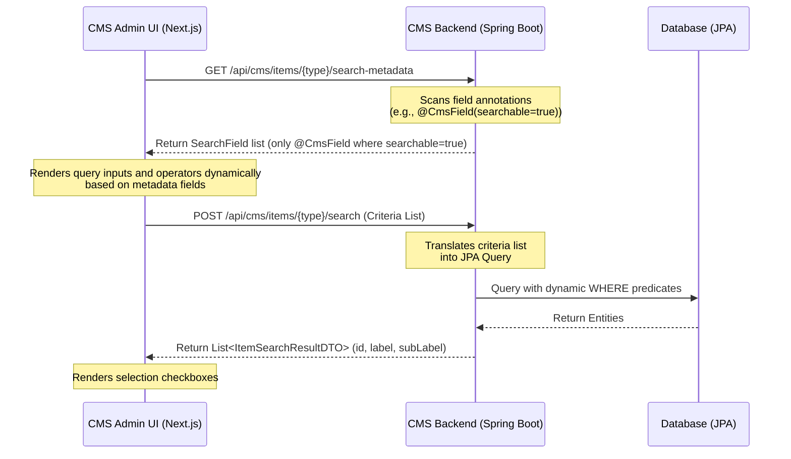

## Table of Contents
{: .no_toc}

* TOC
{:toc}

---

## Introduction

In [Part 1 of the Headless CMS case study](/case-studies/headless-cms-demo-runtime-composition), we discussed how we decoupled frontend page structures from backend schemas using slot-based layout engines, two-stage catalog publishing, and topological sync operations. 

While that setup solved page rendering and publishing isolation, a new challenge quickly emerged: **administrative search and item selection**. 

When content editors build landing pages, they frequently need to configure components that link to catalog items, such as a "Product Carousel" referencing specific products, or a "Trending Articles" list referencing editorial content. 

If we hardcode a custom search endpoint and a unique search modal for every new entity type, we create significant UI code duplication and tight coupling. Every new domain model would require:
1. A new backend REST endpoint for filtering.
2. A new frontend API client method.
3. A unique modal component with specialized search inputs and results styling.

To solve this, we introduced a metadata-driven field model that powers generic entity search today and lays the foundation for additional schema-driven CMS capabilities discussed in later parts of this series. The result is a CMS Admin UI that can dynamically discover searchable attributes of any registered backend entity and build interactive search filters at runtime, without requiring frontend code changes when a new domain is added.

---

## The Generic Search Workflow

The core idea of this architecture is to treat the search schema as metadata. Rather than the CMS Admin UI knowing what fields a `Product` or `Article` has, it queries the backend's metadata registry for that entity type. 



By decoupling the search interface from the database schema:
* The backend remains the single source of truth for searchable fields.
* The frontend admin UI resolves input controls dynamically.
* The search execution layer routes criteria to domain-specific JPA query builders.

---

## Backend: Annotation-Driven Metadata

In Part 1, we introduced `@CmsField` as the metadata contract used to generate dynamic CMS forms. In this article, we extend the same annotation so it also describes which fields participate in generic entity search.

Although `@CmsField` was originally introduced to describe form metadata, it also provides enough information to drive generic search. By adding `searchable = true`, the same metadata becomes the source of truth for both form generation and search schema registration.

### 1. The Unified Field Annotation

```java
@Target(ElementType.FIELD)
@Retention(RetentionPolicy.RUNTIME)
public @interface CmsField {
    String displayName();
    CmsFieldType type() default CmsFieldType.STRING;
    String placeholder() default "";
    boolean searchable() default false;
    Class<? extends ItemModel> targetEntity() default ItemModel.class;
    ReferenceCardinality cardinality() default ReferenceCardinality.SINGLE;
}
```

For fields representing relations, the `ReferenceCardinality` enum defines whether the field accepts a single item or multiple items:

```java
public enum ReferenceCardinality {
    SINGLE,
    MULTIPLE
}
```


### 2. Annotating the Entities

Any entity class can expose its searchable properties to the generic search engine by applying `@CmsField(searchable = true, ...)`. For instance, the `Product` entity exposes its catalog code, name, and price:

```java
public class Product extends CatalogAwareModel {

    @CmsField(
        displayName = "Product Code",
        type = CmsFieldType.STRING,
        searchable = true
    )
    private String code;

    @CmsField(
        displayName = "Product Name",
        type = CmsFieldType.STRING,
        searchable = true
    )
    private String name;

    @CmsField(
        displayName = "Price",
        type = CmsFieldType.NUMBER,
        searchable = true
    )
    private BigDecimal price;

    // Standard getters and setters...
}
```

---

## Backend: Schema Reflection & Criteria Routing

Our backend separates two concerns: `CmsTypeRegistry` scans and caches entity metadata at application startup, while `ItemSearchService` uses that registry to execute criteria-based JPA queries at request time.

### 1. The Metadata Registry

At application startup, `CmsTypeRegistry` scans the JPA metamodel, finds all `ItemModel` subclasses, and caches their metadata into an in-memory map keyed by lowercase type code:

```java
public class CmsTypeRegistry {
    private final Map<String, CmsTypeMetadata> registry = new ConcurrentHashMap<>();

    @PostConstruct
    public void init() {
        // Scan JPA metamodel for all entities extending ItemModel
        for (EntityType<?> entityType : entityManager.getMetamodel().getEntities()) {
            Class<?> javaType = entityType.getJavaType();
            if (ItemModel.class.isAssignableFrom(javaType)) {
                String typeCode = javaType.getSimpleName().toLowerCase();
                registry.put(typeCode, buildTypeMetadata(javaType));
            }
        }
    }

    public CmsTypeMetadata getTypeMetadata(String code) {
        return registry.get(code.toLowerCase());
    }
}
```

`CmsTypeMetadata` holds the entity class reference alongside the list of reflected field metadata objects built from `@CmsField` annotations. New entity types are picked up automatically at startup with no manual registration code required.

### 2. Runtime Metadata Extraction

When the frontend requests search metadata for an entity type, `ItemSearchService` delegates the lookup to `CmsTypeRegistry`, which has already pre-computed the field metadata at startup. The service simply filters for searchable fields and maps them into lightweight `SearchField` DTOs (containing `name`, `displayName`, and `type`):

```java
public class ItemSearchService {

    public ItemSearchMetadataDTO getSearchMetadata(String type) {
        CmsTypeMetadata meta = cmsTypeRegistry.getTypeMetadata(type);
        
        List<SearchField> fields = meta.getFields().stream()
                .filter(CmsFieldMetadata::isSearchable)
                .map(f -> new SearchField(f.getName(), f.getDisplayName(), f.getType().name().toLowerCase()))
                .collect(Collectors.toList());
                
        return new ItemSearchMetadataDTO(fields);
    }
}
```

**Separation of Concerns**: Delegating type lookups to `CmsTypeRegistry` keeps `ItemSearchService` focused on query execution. By pre-computing and caching the reflected field lists in `CmsTypeMetadata` during application startup, the search metadata endpoint becomes a fast, in-memory operation that avoids reflection overhead during request handling.

### 3. Generic Query Execution & Dynamic Type Conversion

To search items, our controller accepts a structured list of criteria, where each criterion specifies a field, an operator (such as `EQUALS`, `CONTAINS`, `MORE_THAN`, `LESS_THAN`), and a search value.

Standardizing our search output structure into a common `ItemSearchResultDTO` allows our frontend UI to display search listings uniformly without knowing the exact database schema. By declaring a polymorphic `toItemSearchResultDTO()` method on our root entity superclass (`ItemModel`) with a default fallback implementation (which returns the entity ID, its simple class name as the display label, and its creation timestamp as the sub-label), our search service maps results cleanly without type-checking specific domain classes.

Additionally, REST search parameters arrive from the frontend as JSON strings (e.g., `"100.00"` or `"true"`).

Because JPQL parameters must match the underlying Java field type, our engine must perform **dynamic parameter type conversion** before binding query values. Using the pre-computed metadata, the service inspects the field type and automatically parses string inputs into `BigDecimal`, `Long`, `Integer`, `Double`, or `Boolean` instances:

```java
public List<ItemSearchResultDTO> searchItems(String type, List<SearchCriteria> criteria) {
    CmsTypeMetadata meta = cmsTypeRegistry.getTypeMetadata(type);

    List<?> entities = executeQuery(meta, criteria);
    return entities.stream()
            .map(e -> ((ItemModel) e).toItemSearchResultDTO())
            .collect(Collectors.toList());
}

private <T> List<T> executeQuery(CmsTypeMetadata meta, List<SearchCriteria> criteria) {
    Class<T> clazz = (Class<T>) meta.getEntityClass();
    Set<String> allowedFields = getAllowedFields(meta);
    StringBuilder jpql = new StringBuilder("SELECT x FROM ")
            .append(clazz.getSimpleName())
            .append(" x WHERE 1=1");
    Map<String, Object> params = new HashMap<>();

    for (int i = 0; i < criteria.size(); i++) {
        SearchCriteria c = criteria.get(i);
        if (!allowedFields.contains(c.getField()) || c.getValue().trim().isEmpty()) {
            continue;
        }

        String paramName = c.getField() + i;
        SearchOperator operator = c.getOperator();
        
        CmsFieldMetadata fieldMeta = meta.getFields().stream()
                .filter(f -> f.getName().equals(c.getField()))
                .findFirst()
                .orElse(null);

        // Coerce CONTAINS to EQUALS for numeric fields
        if (isNumericField(fieldMeta, c.getField()) && operator == SearchOperator.CONTAINS) {
            operator = SearchOperator.EQUALS;
        }

        Object paramValue = convertParamValue(fieldMeta, c.getField(), c.getValue());

        switch (operator) {
            case EQUALS -> appendEquals(jpql, params, c.getField(), paramName, paramValue);
            case MORE_THAN -> appendGreaterThan(jpql, params, c.getField(), paramName, paramValue);
            case LESS_THAN -> appendLessThan(jpql, params, c.getField(), paramName, paramValue);
            default -> appendContains(jpql, params, c.getField(), paramName, c.getValue());
        }
    }

    Query query = entityManager.createQuery(jpql.toString(), clazz);
    params.forEach(query::setParameter);
    return query.getResultList();
}
```

> **Note**: Helper methods `getAllowedFields()`, `isNumericField()`, `convertParamValue()`, and the `append*()` methods perform the metadata-based type checking, conversion logic, and JPQL clause construction. They're omitted here for brevity.

**Key Design Points**:

- **Allow-Listing Primary Keys**: `getAllowedFields()` automatically includes `"id"` even without `@CmsField(searchable = true)`, enabling the backend to fetch saved component selections by primary key.
- **Parameter Name Uniqueness**: Appending the loop index (`key + i`) prevents JPQL parameter collisions when multiple criteria target the same field.
- **JPQL Injection Protection**: Field names are validated against the annotation-derived allow-list, operators are strongly typed, and search values are bound as named parameters, and are not concatenated into the query string.
- **Type Safety**: The `SearchOperator` enum and metadata-based type conversion ensure that numeric fields reject pattern matching operators and parse values correctly.

**Production Considerations**: This implementation focuses on demonstrating the metadata-driven pattern. Production systems should add pagination (`.setMaxResults()`), sorting, and handle edge cases like entity name collisions across packages.

---

## Frontend: Schema-Driven Selection Fields

On the frontend, when configuring a component, the form loader dynamically maps fields of type `REFERENCE` to selection inputs based on the target entity type and cardinality, using the schema returned by the backend.

### 1. Reference Metadata Fetching

During component initialization, the form loader checks if a field type is `reference`, fetches its metadata schema, and loads initial search results:

```tsx
if (field.type === 'reference') {
  const itemType = field.referenceTarget; // e.g. "product"
  
  const meta = await cmsApiClient.getSearchMetadata(itemType);
  setSearchMetadata(prev => ({ ...prev, [itemType]: meta.data }));
  
  const res = await cmsApiClient.searchItems(itemType, []);
  setSearchResults(prev => ({ ...prev, [itemType]: res.data }));
}
```

When `/api/cms/items/product/search-metadata` is called, the backend returns a lightweight JSON schema describing only the allowed search attributes:

```json
{
  "fields": [
    {
      "name": "code",
      "displayName": "Product Code",
      "type": "string"
    },
    {
      "name": "price",
      "displayName": "Price",
      "type": "number"
    }
  ]
}
```

This JSON schema acts as the contract between backend and frontend, allowing the admin UI to build appropriate query forms without hardcoded UI components.

### 2. Rendering Search Filters Dynamically

The metadata drives dynamic rendering of type-aware search controls:

```tsx
{field.type === 'reference' && (
  <div>
    {searchMetadata[field.referenceTarget]?.fields?.map(metaField => (
      <div key={metaField.name}>
        {/* Type-aware operator dropdown */}
        <select value={...} onChange={...}>
          {metaField.type !== 'number' && <option value="CONTAINS">Contains</option>}
          <option value="EQUALS">Equals</option>
          {metaField.type === 'number' && (
            <>
              <option value="MORE_THAN">More Than</option>
              <option value="LESS_THAN">Less Than</option>
            </>
          )}
        </select>
        <input placeholder={`Search ${metaField.displayName}...`} onChange={...} />
      </div>
    ))}
    
    {searchResults[field.referenceTarget]?.map(item => (
      <label key={item.id}>
        {/* Cardinality-driven input type */}
        <input type={field.referenceCardinality === 'MULTIPLE' ? "checkbox" : "radio"} onChange={...} />
        <span>{item.label}</span>
      </label>
    ))}
  </div>
)}
```

The UI iterates over `searchMetadata.fields` to generate inputs. Type conditionals (`metaField.type === 'number'`) control which operators appear, and cardinality (`SINGLE` vs. `MULTIPLE`) determines checkbox vs. radio rendering, all without hardcoding entity-specific forms.

---

## Extending the System to New Domains

By combining JPA metamodel auto-discovery with field-level `@CmsField` annotations and standardizing search UI selection flows, adding a new domain type (like `Article` or `Event`) is straightforward and requires no separate registration code.

### Step 1: Annotating the Entity Fields
To make an `Article` searchable, we apply `@CmsField(searchable = true)` directly to the target properties:

```java
public class Article extends CatalogAwareModel {

    @CmsField(
        displayName = "Title",
        type = CmsFieldType.STRING,
        searchable = true
    )
    private String title;

    @CmsField(
        displayName = "Slug",
        type = CmsFieldType.STRING,
        searchable = true
    )
    private String slug;

    @CmsField(
        displayName = "Body",
        type = CmsFieldType.TEXT
    )
    private String body;
}
```

### Step 2: Defining the CMS Field on the Component
We define the component's field type using `CmsFieldType.REFERENCE` and specify the target entity class along with the cardinality. For example, a `TrendingArticleComponent` references multiple `Article` entities:

```java
public class TrendingArticleComponent extends Component {
    private String title;

    @CmsField(
        displayName = "Articles",
        type = CmsFieldType.REFERENCE,
        targetEntity = Article.class,
        cardinality = ReferenceCardinality.MULTIPLE
    )
    private String articleSlugs;
}
```

Similarly, for single-item selection, a `TopEventComponent` references one `Event`:

```java
public class TopEventComponent extends Component {
    @CmsField(
        displayName = "Featured Event",
        type = CmsFieldType.REFERENCE,
        targetEntity = Event.class,
        cardinality = ReferenceCardinality.SINGLE
    )
    private String eventSlug;
}
```

### Frontend Extensibility Without Code Changes

Without modifying frontend React code, creating custom components, or registering new REST endpoints, the Admin UI automatically:
1. Detects the `REFERENCE` type along with target and cardinality details from the schema.
2. Queries the metadata schema at `/api/cms/items/article/search-metadata` and `/api/cms/items/event/search-metadata`.
3. Dynamically renders operator dropdowns and search text boxes labeled *"Search Title..."* based on the returned annotations.
4. Executes searches and dynamically renders checkboxes (for `MULTIPLE` cardinality) or radio buttons (for `SINGLE` cardinality) based on field metadata.

Here is how the dynamic selection interface renders in the Admin UI for single-item fields (like `TopEventComponent`):


When an editor interacts with the search filters, the dynamic operator dropdown allows precise querying (`Contains`, `Equals`, etc.):


For numeric fields (such as product price), the dropdown dynamically restricts options to mathematical operators (`Equals`, `More Than`, `Less Than`):


Executing a numeric search dynamically filters matching database entities based on the comparison:


For multi-item fields (like `TrendingArticleComponent`), the interface renders multiple selection checkboxes:


When searching, the Admin UI inspects the selected operators and transmits structured criteria payloads over the network:


On the backend, because JPA's metamodel automatically discovers entity classes at application startup and our query generator inspects field annotations at runtime, adding a searchable entity requires **no manual service or registry code modifications**. We only need to annotate the desired entity properties with `@CmsField(searchable = true)` and optionally override `toItemSearchResultDTO()` to customize display labels (if not overridden, it falls back to returning the entity ID, its simple class name as the display label, and its creation timestamp as the sub-label).

**When Would I Not Use This Architecture?**: This approach is intentionally designed for administrative CRUD search with a small, finite operator set. For full-text search, typo tolerance, relevance ranking, faceted navigation, or large-scale catalog search, dedicated search engines such as OpenSearch, Elasticsearch, or Solr remain the more appropriate choice.

---

## Conclusion

To put the impact of this architecture in perspective, consider the engineering overhead of introducing a new searchable entity (like `Article` or `Event`) into our content system:
- **Boilerplate Approach**: Typically requires writing a new backend controller and endpoint (~50 lines of Java), a new frontend API client method (~10 lines of TypeScript), and a custom React search modal with input form state management (~150 lines of JSX/CSS). As the number of searchable domain models grows, the amount of repetitive controller, client, and UI code scales linearly.
- **Dynamic Metadata Approach**: Requires adding exactly **1 annotation property** (`@CmsField(searchable = true)`) on the backend entity. The JPA metamodel dynamically registers the class, the reflection engine constructs the allowlist, and the schema-driven frontend builders automatically draw the search controls and operators at runtime.

By treating search schemas as field-level metadata and combining them with JPA metamodel auto-discovery, we remove boilerplate registration maps and reduce the backend integration effort for new domain entities down to field annotations. Because our query execution layer dynamically resolves allowed fields and constructs JPQL queries at runtime, our architecture establishes a clean separation of concerns and provides content editors with a consistent search interface across all entity types without requiring domain-specific query boilerplate.

---

## What's Next?

We've built a generic search engine that discovers entity schemas at runtime and renders appropriate search filters without hardcoding entity types. However, a complete content management system requires more than just search: editors need to browse all available domain models, view data in tabular listings, and create or modify records through structured forms.

If we were to follow traditional CMS patterns, every new entity would require a dedicated navigation menu item, a custom data table component with hardcoded column definitions, and specialized create and edit forms with entity-specific input controls. But what if the backend could describe its own structure to the frontend by exposing an "All Models" registry that generates navigation automatically, and serving table schemas that render any entity type through a single reusable component?

In the next part of this series, we'll extend the same metadata-driven foundation to power a fully dynamic administrative interface where introducing a new domain model requires no frontend code changes or UI redeployments.

