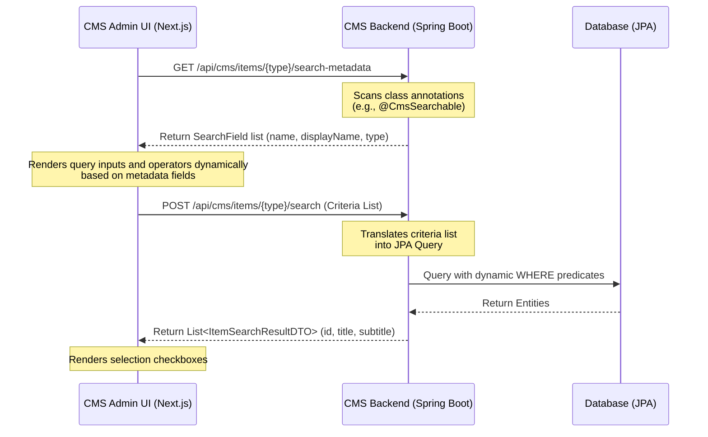

## Table of Contents
{: .no_toc}

* TOC
{:toc}

---

## Introduction

In [Part 1 of the Headless CMS case study](/case-studies/headless-cms-demo-runtime-composition), we discussed how we decoupled frontend page structures from backend schemas using slot-based layout engines, two-stage catalog publishing, and topological sync operations. 

While that setup solved page rendering and publishing isolation, a new challenge quickly emerged: **administrative search and item selection**. 

When content editors build landing pages, they frequently need to configure components that link to catalog items, such as a "Product Carousel" referencing specific products, or a "Trending Articles" list referencing editorial content. 

If we hardcode a custom search endpoint and a unique search modal for every new entity type, we create significant UI code duplication and tight coupling. Every new domain model would require:
1. A new backend REST endpoint for filtering.
2. A new frontend API client method.
3. A unique modal component with specialized search inputs and results styling.

To solve this, we implemented an **annotation-driven metadata registry and dynamic search UI**. This system allows the frontend to dynamically query searchable attributes of *any* backend entity and build interactive search filters at runtime, requiring zero frontend code updates when registering new domains.

---

## The Generic Search Workflow

The core idea of this architecture is to treat search schema as metadata. Rather than the storefront admin panel knowing what fields a `Product` or `Article` has, it queries the backend's metadata registry for that entity type. 



By decoupling the search interface from the database schema:
* The backend remains the single source of truth for searchable fields.
* The frontend admin UI resolves input controls dynamically.
* The search execution layer routes criteria to domain-specific JPA query builders.

---

## Backend: Annotation-Driven Metadata

To make a Java entity searchable within the administrative panel, we declare a custom, repeatable `@CmsSearchable` annotation. This maps directly to class-level attributes, identifying the property path, its administrative display name, and its input field type.

### 1. Declaring the Annotations

```java
@Target(ElementType.TYPE)
@Retention(RetentionPolicy.RUNTIME)
@Repeatable(CmsSearchables.class)
public @interface CmsSearchable {
    String name();           // Field path in JPA entity (e.g. "code", "title")
    String displayName();    // Label shown to content editor
    String type() default "string";
}
```

```java
// CmsSearchables.class (Container for Repeatability)

@Target(ElementType.TYPE)
@Retention(RetentionPolicy.RUNTIME)
public @interface CmsSearchables {
    CmsSearchable[] value();
}
```

### 2. Annotating the Entities

Any entity class can register its searchable properties by applying these annotations. For instance, the `Product` entity exposes its catalog code and name:

```java
@Entity
@CmsSearchable(name = "name", displayName = "Product Name", type = "string")
@CmsSearchable(name = "code", displayName = "Product Code", type = "string")
public class Product extends CatalogAwareModel {
    private String code;
    private String name;
    private Double price;
    // Getters and Setters...
}
```

---

## Backend: Schema Reflection & Criteria Routing

Our backend hosts a single administrative search service (`ItemSearchService`) that exposes metadata and runs criteria-based JPA filters.

### 1. Reflecting Search Fields

When the frontend asks for metadata of a type, our service scans the target class definition for `@CmsSearchable` annotations to return a list of fields and dynamically derive query allowlists:

```java
// ItemSearchService.java (Part 1 - Metadata Extraction & Allowlist Resolution)
@Service
@RequiredArgsConstructor
public class ItemSearchService {

    private final EntityManager entityManager;
    private static final Map<String, Class<?>> TYPE_TO_CLASS = Map.of(
        "product", Product.class,
        "article", Article.class,
        "event", Event.class
    );

    private List<SearchField> getSearchFields(Class<?> clazz) {
        List<SearchField> fields = new ArrayList<>();
        if (clazz.isAnnotationPresent(CmsSearchables.class)) {
            CmsSearchables searchables = clazz.getAnnotation(CmsSearchables.class);
            for (CmsSearchable searchable : searchables.value()) {
                fields.add(new SearchField(searchable.name(), searchable.displayName(), searchable.type()));
            }
        } else if (clazz.isAnnotationPresent(CmsSearchable.class)) {
            CmsSearchable searchable = clazz.getAnnotation(CmsSearchable.class);
            fields.add(new SearchField(searchable.name(), searchable.displayName(), searchable.type()));
        }
        return fields;
    }

    public ItemSearchMetadataDTO getSearchMetadata(String type) {
        Class<?> clazz = TYPE_TO_CLASS.get(type.toLowerCase());
        if (clazz == null) return new ItemSearchMetadataDTO(List.of());
        return new ItemSearchMetadataDTO(getSearchFields(clazz));
    }

    private Set<String> getAllowedFields(Class<?> clazz) {
        return getSearchFields(clazz).stream()
                .map(SearchField::getName)
                .collect(Collectors.toSet());
    }
}
```

### 2. Executing Dynamic JPA Queries

To search items, our controller accepts a structured list of criteria, where each criterion specifies a field, an operator (such as `EQUALS`, `CONTAINS`, `GREATER_THAN`, `LESS_THAN`), and a search value.

Standardizing our search output structure into a common `ItemSearchResultDTO` allows our frontend UI to display search listings uniformly without knowing the exact database schema. By declaring a polymorphic `toItemSearchResultDTO()` method on our root entity superclass (`ItemModel`) with a default fallback implementation (showing model name, ID, and timestamp), our search service maps results cleanly without type-checking specific domain classes:

```java
// ItemSearchService.java (Part 2 - Generic Query Execution)
public List<ItemSearchResultDTO> searchItems(String type, List<SearchCriteria> criteria) {
    Class<?> clazz = TYPE_TO_CLASS.get(type.toLowerCase());
    if (clazz == null) return List.of();

    return executeSearch(clazz, criteria);
}

private ItemSearchResultDTO mapToDTO(Object entity) {
    if (entity instanceof ItemModel itemModel) {
        return itemModel.toItemSearchResultDTO();
    }
    return null;
}

private <T> List<ItemSearchResultDTO> executeSearch(Class<T> clazz, List<SearchCriteria> criteria) {
    Set<String> allowedFields = getAllowedFields(clazz);
    StringBuilder jpql = new StringBuilder("SELECT x FROM ").append(clazz.getSimpleName()).append(" x WHERE 1=1");
    Map<String, Object> params = new HashMap<>();

    for (int i = 0; i < criteria.size(); i++) {
        SearchCriteria c = criteria.get(i);
        String key = c.getField();
        String value = c.getValue();
        if (allowedFields.contains(key) && value != null && !value.trim().isEmpty()) {
            String paramName = key + i;
            switch (c.getOperator() != null ? c.getOperator() : SearchOperator.CONTAINS) {
                case EQUALS:
                    jpql.append(" AND x.").append(key).append(" = :").append(paramName);
                    params.put(paramName, value.trim());
                    break;
                case GREATER_THAN:
                    jpql.append(" AND x.").append(key).append(" > :").append(paramName);
                    params.put(paramName, value.trim());
                    break;
                case LESS_THAN:
                    jpql.append(" AND x.").append(key).append(" < :").append(paramName);
                    params.put(paramName, value.trim());
                    break;
                case CONTAINS:
                default:
                    jpql.append(" AND x.").append(key).append(" LIKE :").append(paramName);
                    params.put(paramName, "%" + value.trim() + "%");
                    break;
            }
        }
    }

    Query query = entityManager.createQuery(jpql.toString(), clazz);
    for (Map.Entry<String, Object> param : params.entrySet()) {
        query.setParameter(param.getKey(), param.getValue());
    }

    @SuppressWarnings("unchecked")
    List<T> results = query.getResultList();
    return results.stream()
            .map(this::mapToDTO)
            .filter(java.util.Objects::nonNull)
            .collect(Collectors.toList());
}
```

**Differentiating Parameter Names**: We iterate through the criteria list using an indexed `for` loop rather than a standard `for-each` loop. By appending the loop index to the parameter name (e.g., `key + i`), we guarantee that each parameter name is unique. This prevents parameter collisions in the JPQL query if a request contains multiple search constraints targeting the same field (for example, hitting the search API directly with multiple rules for one field, even though the standard Admin UI only renders a single input box per field).

**Missing Query Pagination**: In our proof-of-concept implementation, we call `query.getResultList()` directly without pagination limits. For production environments, we should invoke `.setMaxResults(limit)` or pass pagination offsets to prevent loading the entire database table into memory when an empty search query is evaluated at form initialization.

---

## Frontend: Dynamic Selection Fields

On the frontend, fields are resolved using a schema-driven form builder. When configuring a component, we use the syntax `multiple_items:{itemType}` (e.g., `multiple_items:product`) to designate a multi-item selection input, and `item:{itemType}` (e.g., `item:event`) to designate a single-item selection input.

### 1. Suffix Parsing and Metadata Fetching

During component initialization, the form loader splits the type string to discover the target item domain, queries its metadata, and fetches default items:

```tsx
// page.tsx (Component Editor Initializer)
if (field.type.startsWith('multiple_items:') || field.type.startsWith('item:')) {
  const itemType = field.type.split(':')[1]; // e.g. "product"
  
  // 1. Fetch metadata schema of target entity
  const meta = await cmsApiClient.getSearchMetadata(itemType);
  setSearchMetadata(prev => ({ ...prev, [itemType]: meta.data }));
  
  // 2. Load default items (empty search)
  const res = await cmsApiClient.searchItems(itemType, []);
  setSearchResults(prev => ({ ...prev, [itemType]: res.data }));
}
```

### 2. Rendering Search Filters Dynamically

Because the metadata returns the list of searchable attributes, we iterate over the properties to display custom search operator dropdowns and query text boxes:

```tsx
// page.tsx (Field Form Renderer - Simplified)
{(field.type.startsWith('multiple_items:') || field.type.startsWith('item:')) && (
  <div className="space-y-2 mt-2">
    {/* 1. Render dropdown operator and text search inputs for metadata properties */}
    {searchMetadata[itemType]?.fields?.map(metaField => (
      <div key={metaField.name} className="flex gap-2">
        <select 
          value={searchCriteria[metaField.name]?.operator || 'CONTAINS'}
          onChange={(e) => updateSearchOperator(metaField.name, e.target.value)}
          className="border rounded px-2 py-1"
        >
          <option value="CONTAINS">Contains</option>
          <option value="EQUALS">Equals</option>
          <option value="GREATER_THAN">Greater Than</option>
          <option value="LESS_THAN">Less Than</option>
        </select>
        <input 
          placeholder={`Search ${metaField.displayName}...`}
          onChange={(e) => updateSearchCriteria(metaField.name, e.target.value)}
          className="border rounded px-2 py-1 flex-1"
        />
      </div>
    ))}
    
    {/* 2. Render Selection List based on search results */}
    <div className="selection-list">
      {searchResults[itemType]?.map(item => {
        const isMultiple = field.type.startsWith('multiple_items:');
        return (
          <label key={item.id}>
            {/* Render Checkbox for 'multiple_items', Radio for 'item' */}
            <input
              type={isMultiple ? "checkbox" : "radio"}
              onChange={() => handleItemSelection(field.name, item.id, isMultiple)}
            />
            <span>{item.title}</span>
          </label>
        );
      })}
    </div>
  </div>
)}
```

With this implementation, the search form inputs and filtering behaviors are generated purely from the annotations retrieved at runtime.

---

## Extending the System to New Domains

By isolating domain-specific fields on the backend via annotations and standardizing search UI selection flows, adding a completely new domain type (like `Article` or `Event`) is extremely simple.

### Step 1: Annotating the new Entity on the Backend
To add an `Article` search, we simply declare `@CmsSearchable` annotations on the `Article.java` class:

```java
@Entity
@CmsSearchable(name = "title", displayName = "Article Title", type = "string")
public class Article extends CatalogAwareModel {
    private String title;
    private String body;
    // ...
}
```

### Step 2: Defining the CMS Field on the Component
We define the component's field type using our `multiple_items:{itemType}` syntax. For example, a `TrendingArticleComponent` is defined with a property `article_ids` of type `multiple_items:article`:

```java
@Entity
public class TrendingArticleComponent extends Component {
    private String title;

    @Column(name = "article_ids")
    @CmsField(displayName = "Articles", type = "multiple_items:article", required = true)
    private String articleIds; 
}
```

Similarly, we can support single-item selection using the `item:{itemType}` syntax. For instance, a `TopEventComponent` requires only a single event selection:

```java
@Entity
public class TopEventComponent extends Component {
    private String title;

    @Column(name = "event_id")
    @CmsField(displayName = "Event", type = "item:event", required = true)
    private String eventId; 
}
```

### The Result

Without writing any frontend React code, creating custom components, or registering new REST endpoints, the Admin UI automatically:
1. Detects the `multiple_items:article` and `item:event` type tags.
2. Queries the metadata schema at `/api/cms/items/article/search-metadata` and `/api/cms/items/event/search-metadata`.
3. Dynamically renders operator dropdowns and search text boxes labeled *"Search Article Title..."* based on the returned annotations.
4. Executes searches and dynamically renders checkboxes (for `multiple_items`) or radio buttons (for `item`) based on the field prefix.

Here is how the dynamic selection interface renders in the Admin UI for single-item fields (like `TopEventComponent`):


When an editor interacts with the search filters, the dynamic operator dropdown allows precise querying (`CONTAINS`, `EQUALS`, etc.):


For multi-item fields (like `TrendingArticleComponent`), the interface renders multiple selection checkboxes:


When searching, the Admin UI inspects the selected operators and transmits structured criteria payloads over the network:


On the backend, because our query generator dynamically inspects annotations to build JPQL queries and our entity superclass (`ItemModel`) polymorphically handles DTO translations, we only need to make two minor additions when registering a new entity:
1. Add the `@CmsSearchable` annotations to the new entity class and optionally override `toItemSearchResultDTO()` to customize its display labels (if not overridden, it gracefully falls back to displaying the entity name, ID, and creation timestamp).
2. Register the class mapping in `TYPE_TO_CLASS`.

---

## Conclusion

By treating search schemas as reflection-based metadata and generating UI forms dynamically, we significantly reduce both frontend and backend maintenance overhead. Because our query execution layer dynamically resolves allowed fields and constructs JPQL queries at runtime, our architecture establishes a clean separation of concerns and provides content editors with a consistent search interface across all entity types without requiring domain-specific query boilerplate.

