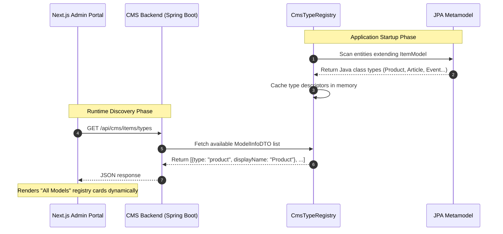
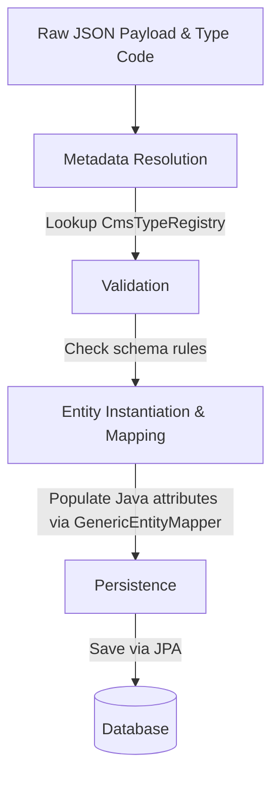

## Table of Contents
{: .no_toc}

* TOC
{:toc}

---

## Introduction

In [Part 2 of the Headless CMS case study](/case-studies/headless-cms-demo-generic-search), we discussed how we decoupled administrative search and item selection using annotation-driven reflection (`@CmsField`) and dynamic JPQL query execution. That setup allowed content editors to search and link catalog items across any domain entity without requiring domain-specific REST endpoints or custom modal forms.

While our generic search interface solved relational selection during landing page composition, a broader administrative challenge remained: **managing the domain entities themselves**.

When content editors and administrators interact with a CMS, they need more than just search: they need to browse all available domain models, view records in tabular listings, and create or modify items through structured CRUD interfaces.

---

## The Architectural Goal: A Frontend Without Domain Knowledge

Traditional content management systems often treat every domain entity as a special case. Every new domain model typically requires changes across both the backend and frontend: new REST endpoints, routing, tables, forms, and another deployment of the administration UI.

We wanted to build an architecture that avoids this repetitive cycle. The primary design objective for our administrative interface can be summarized in one principle: **the frontend should operate without static knowledge of specific domain models**.

Instead of hardcoding menus and data tables for products, articles, or categories, the Next.js admin portal simply asks the Spring Boot backend what domain models exist. The backend describes its own schema, and the frontend dynamically renders the appropriate navigation, data tables, and management interfaces based on the metadata it receives.

Rather than exposing only data, the backend exposes its own capabilities and schema. That immediately differentiates it from traditional REST APIs. This metadata powers the generic search interface discussed in [Part 2](/case-studies/headless-cms-demo-generic-search), drives the dynamic CRUD tables covered in this article, and forms the foundation for dynamic form generation in Part 4.

One critical detail that makes this design reliable is that we are not building generic CRUD over arbitrary, unbounded database tables. We anchor the entire system on a controlled abstraction: the `ItemModel` superclass. Without this shared abstraction, the framework would need to make assumptions about arbitrary JPA entities, making generic CRUD significantly harder to validate and secure. Because every managed entity inherits from this base contract, the backend can safely expose type discovery, schema metadata, searching, and modification through a unified API while still allowing each domain class to define its own specialized attributes.

---

## 1. The Self-Describing Backend

Hardcoding administrative navigation menus does not scale as a platform grows. To make adding a new entity as simple as writing a new JPA class, a metadata-driven backend must be capable of describing itself to clients.

The hero of this architecture is the `CmsTypeRegistry`. At application startup, it inspects the JPA Metamodel to discover all registered entities that extend `ItemModel`. Using the JPA Metamodel avoids manually maintaining entity registrations while ensuring only managed persistence classes are discovered. It scans their class definitions, reads field-level metadata annotations, and constructs an in-memory registry of available content types.



To expose this registry, the backend provides a single discovery endpoint in `ItemSearchController`:

```java
// ItemSearchController.java
/**
 * Gets all registered domain model types.
 *
 * @return Response entity containing a list of registered CMS types.
 */
@GetMapping("/types")
public ResponseEntity<ApiResponse<List<ModelInfoDTO>>> getAvailableTypes() {
    log.info("GET /api/cms/items/types");
    List<ModelInfoDTO> types = itemSearchService.getAvailableTypes();
    return ResponseEntity.ok(ApiResponse.success(types));
}
```

On the frontend, the `ModelsRegistryPage` component queries this endpoint when loading the dashboard. It iterates through the returned array and renders a navigation card for every discovered entity type:

```tsx
// cms-frontend/src/app/cms/models/page.tsx
export default function ModelsRegistryPage() {
  const [models, setModels] = useState<ModelInfo[]>([]);

  useEffect(() => {
    async function fetchModels() {
      const res = await cmsApiClient.getTypes();
      setModels(res.data || []);
    }
    fetchModels();
  }, []);

  return (
    <div className="grid grid-cols-1 md:grid-cols-2 lg:grid-cols-3 gap-6">
      {models.map((model) => (
        <div key={model.type} className="group bg-white rounded-xl border border-gray-150 p-6">
          <h2 className="text-xl font-bold text-gray-900">{model.displayName}</h2>
          <p className="text-sm text-gray-500 mt-1 font-mono">Type Code: {model.type}</p>
          <Link href={`/cms/models/${model.type}`} className="mt-4 inline-block text-blue-600 font-semibold">
            See Data →
          </Link>
        </div>
      ))}
    </div>
  );
}
```

When a backend engineer introduces a new domain class, such as `@Entity public class Promotion extends ItemModel`, the class is picked up automatically during server initialization. The admin portal displays the new promotion management card immediately without requiring frontend code changes or UI redeployments.

### Addressing Reflection Performance

A common concern when using Java reflection for dynamic schema handling is runtime performance. While extensive reflection during user request processing can degrade throughput, our architecture confines class hierarchy traversal and annotation inspection strictly to the application startup phase.

During startup, `CmsTypeRegistry` evaluates the entity metadata once and stores the resulting schema structures inside immutable data objects within a `ConcurrentHashMap`. When an administrator interacts with the platform at runtime, the metadata-driven CRUD services perform constant-time map lookups against these pre-computed descriptors. Because the system reads from cached memory rather than rescanning Java classes on each HTTP request, reflection overhead is eliminated from the runtime execution path.

---

## 2. Schema-Driven Data Tables

The most important architectural decision in our listing design is that there is only one data table component in the entire administration UI. It renders products, articles, categories, promotions, and every future entity by consuming metadata rather than business-specific code.

When an editor selects an entity from the registry (for example, navigating to `/cms/models/article`), the frontend routes the request to a dynamic catch-all page (`[type]/page.tsx`). The table component has zero static knowledge of domain models. It only understands how to process tabular columns, data rows, and value formatters.

To learn how to render the table, the component requests the unified schema from `/api/cms/items/{type}/metadata`. The backend responds with an `ItemMetadataDTO` payload that includes a `columnShown` array. This array defines which properties should appear as table headers and specifies their presentation order:

```json
{
  "code": "article",
  "displayName": "Article",
  "columnShown": [
    { "name": "title", "displayName": "Title", "type": "STRING", "order": 1 },
    { "name": "slug", "displayName": "Slug", "type": "STRING", "order": 2 }
  ]
}
```

The React component uses this schema to generate table headers dynamically and maps the corresponding values from generic row payloads:

```tsx
// cms-frontend/src/app/cms/models/[type]/page.tsx
<table className="min-w-full divide-y divide-gray-150">
  <thead className="bg-gray-50">
    <tr>
      <th>ID</th>
      {metadata.columnShown.map((col) => (
        <th key={col.name}>{col.displayName}</th>
      ))}
      <th>Created At</th>
      <th>Actions</th>
    </tr>
  </thead>
  <tbody>
    {data.map((row) => (
      <tr key={row.id}>
        <td className="font-mono">{row.id}</td>
        {metadata.columnShown.map((col) => (
          <td key={col.name}>
            {formatCellValue(row.values[col.name], col)}
          </td>
        ))}
        <td>{formatDate(row.values.createdAt)}</td>
        <td>
          <Link href={`/cms/models/${metadata.code}/${row.id}/edit`}>Edit</Link>
          <button onClick={() => handleDelete(row.id)}>Delete</button>
        </td>
      </tr>
    ))}
  </tbody>
</table>
```

To populate the rows, the frontend calls a generic POST endpoint (`/api/cms/items/{type}/list`). The backend returns a list of `CmsRowDTO` objects, where each object contains the entity primary key (`id`) and a flat dictionary (`values: Record<string, any>`) representing the entity attributes and audit timestamps (such as `createdAt`). A presentation formatter on the frontend checks the runtime data types of these dictionary values, cleanly rendering text strings, numeric prices, boolean status badges, and related entity arrays without requiring custom cell components for different business domains.

---

## 3. The Metadata-Driven CRUD Pipeline

While viewing data through generic tables removes UI boilerplate, editing and persisting that data requires careful handling on the backend. When an administrator submits a form to create or modify an item, the frontend sends a raw JSON dictionary containing the input values. The backend must validate and apply this dictionary to a strongly typed JPA entity.

We manage this transformation through a structured processing pipeline inside `CmsCrudService`:



When creating a new entity, `CmsCrudService` executes this pipeline by first verifying the JSON payload against the schema constraints stored in `CmsTypeRegistry`. It then instantiates the target Java class and delegates property assignment to `GenericEntityMapper`:

```java
// CmsCrudService.java
/**
 * Creates a new entity instance dynamically based on registration type and input payload.
 *
 * @param type The lower-case model type code.
 * @param payload The raw JSON fields input map.
 * @return The populated tabular DTO representation of the persisted entity.
 * @throws BadRequestException If validations or instantiation fails.
 */
@Transactional
public CmsRowDTO createEntity(String type, Map<String, Object> payload) {
    CmsTypeMetadata typeMeta = cmsTypeRegistry.getTypeMetadata(type);
    if (typeMeta == null) {
        throw new ResourceNotFoundException("CMS Type not found: " + type);
    }
    
    // Validate incoming JSON attributes against required metadata rules
    cmsValidator.validate(payload, typeMeta, true);
    
    try {
        // Instantiate the entity class dynamically
        ItemModel entity = (ItemModel) typeMeta.getEntityClass().getDeclaredConstructor().newInstance();
        
        // Map JSON properties to entity attributes
        genericEntityMapper.populateEntity(entity, payload, typeMeta, true);
        
        entityManager.persist(entity);
        entityManager.flush();
        
        return genericEntityMapper.mapToRow(entity, typeMeta);
    } catch (Exception e) {
        log.error("Failed to create entity of type {}", type, e);
        throw new BadRequestException("Failed to create " + typeMeta.getDisplayName() + ": " + e.getMessage(), e);
    }
}
```

Updating an existing record follows a parallel workflow. Instead of calling `newInstance()`, the service loads the active database record using `entityManager.find(typeMeta.getEntityClass(), id)`, applies the updated JSON values through `GenericEntityMapper`, and issues a merge operation. Because all domain entities inherit from `ItemModel`, deletion is handled by passing the resolved entity instance directly to `entityManager.remove()`.

---

## 4. Architectural Boundaries

While a self-describing backend eliminates boilerplate for administrative data management, it is important to define where this pattern stops. A generic metadata engine is not a universal substitute for all content management requirements.

This architecture intentionally does not attempt to solve:

1. **Visual Page Builders**: Highly customized drag-and-drop landing page editors or WYSIWYG canvas layouts require specialized, interactive UI components that cannot be rendered effectively from flat table schemas.
2. **Complex State Machines**: While our system supports two-stage catalog publishing (staged versus online), domain entities that require multi-step approval workflows, conditional branching, or external sign-offs require dedicated domain services and state handlers.
3. **Bespoke Business Rules**: Validation rules that depend on cross-service API checks, complex mathematical calculations, or historical data comparisons fall outside the scope of simple annotation-driven constraints. Such logic belongs in dedicated service layers rather than generic mappers.

Acknowledging these boundaries keeps the system grounded. By using generic autodiscovery for standard catalog models and reserving custom React interfaces for specialized layouts, engineering teams can maintain a clean, maintainable balance across their platform.

---

## Conclusion and What Comes Next

After introducing this architecture, adding a new entity became a backend-only task. Engineers create a new `ItemModel` subclass, annotate its fields, restart the application, and the administrative interface automatically provides discovery, listing, search, and CRUD functionality.

By anchoring our domain classes to an `ItemModel` abstraction and relying on `CmsTypeRegistry` to serve descriptors generated from the JPA Metamodel, we built a content management backend that self-describes its structure to frontend clients.

However, viewing data in generic tables is only part of the workflow. When an administrator clicks "Create New" or "Edit" on a discovered model, how does the frontend know whether to render a standard text input, a numeric slider, a boolean toggle switch, a date picker, or a relational entity selector?

In Part 4 of this series, we will examine how we extend this metadata engine to power dynamic form generation, allowing the frontend to construct complete, type-safe editing interfaces and reference pickers at runtime without writing entity-specific form components.
