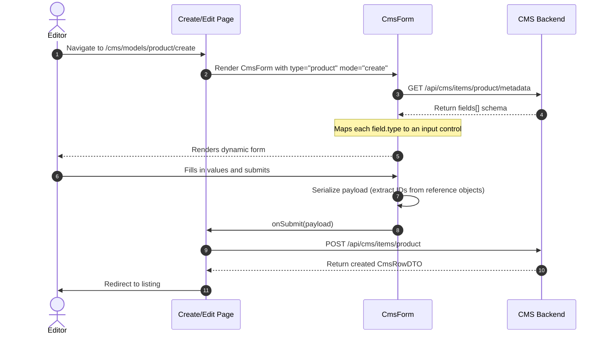
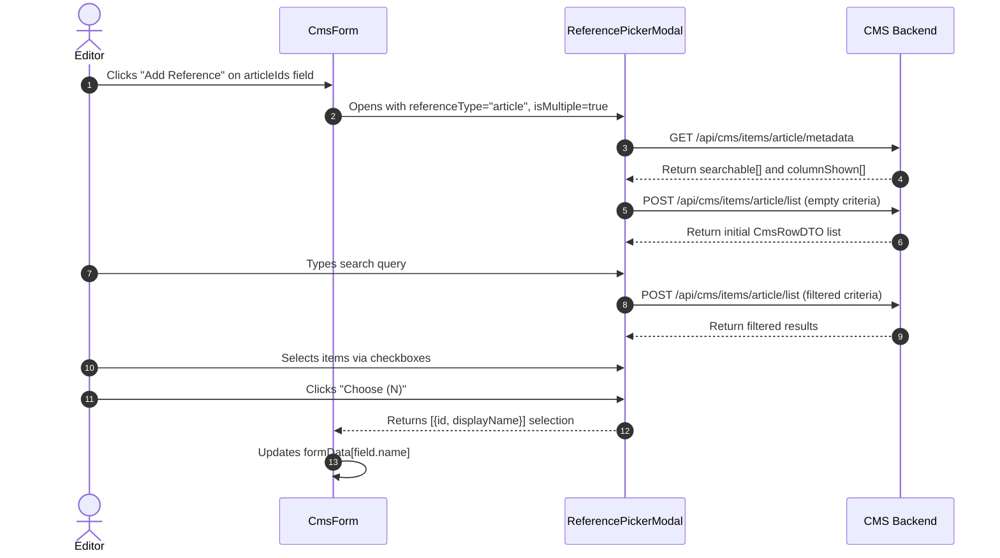

## Table of Contents
{: .no_toc}

* TOC
{:toc}

---

## Introduction

In [Part 3](/case-studies/headless-cms-demo-generic-crud), we established a self-describing backend capable of serving any domain model's schema to the Next.js admin portal. The `CmsTypeRegistry` discovers all `ItemModel` subclasses at startup and the frontend dynamically renders navigation cards and tabular data listings.

But listing data is only one direction of the workflow. Administrators also need to create and edit those records. When an editor clicks "Create New" on a discovered entity, the frontend faces a harder problem than rendering a table: it must decide which kind of input control belongs to each field.

A product name deserves a text input. A product price deserves a number input. An `isActive` flag deserves a checkbox. A related article reference deserves a searchable modal with checkboxes. All of this must happen without the frontend containing a single line of code that knows what a `Product`, `Article`, or `Event` actually is.

This case study covers how we extend the metadata engine from Part 3 to power dynamic form generation and a reusable `ReferencePickerModal` for relational field selection.

---

## The Extended Field Metadata Schema

In Part 3, the backend's unified metadata endpoint (`/api/cms/items/{type}/metadata`) exposed two arrays: `columnShown` (for table headers) and `searchable` (for search filter inputs). To support form generation, we extended the same endpoint's response payload with a third array: `fields`.

This `fields` array represents the complete schema of a domain entity, including information not relevant to tables or search filters:

```json
{
  "code": "product",
  "displayName": "Product",
  "fields": [
    {
      "name": "name",
      "displayName": "Product Name",
      "type": "STRING",
      "requiredOnCreate": true,
      "requiredOnUpdate": true,
      "editableOnCreate": true,
      "editableOnUpdate": true,
      "placeholder": "Enter product name..."
    },
    {
      "name": "price",
      "displayName": "Price",
      "type": "NUMBER",
      "requiredOnCreate": true,
      "requiredOnUpdate": true,
      "editableOnCreate": true,
      "editableOnUpdate": true,
      "placeholder": "0.00"
    },
    {
      "name": "catalog",
      "displayName": "Catalog",
      "type": "REFERENCE",
      "requiredOnCreate": true,
      "editableOnCreate": true,
      "editableOnUpdate": false,
      "reference": "id.adiputera.demo.cms.entity.Catalog",
      "referenceCardinality": "SINGLE"
    }
  ]
}
```

Several field-level attributes shape how the frontend renders and validates inputs:

- **`type`**: Maps to a UI control (`STRING` → text input, `TEXT` → textarea, `NUMBER` → number input, `BOOLEAN` → checkbox, `REFERENCE` → reference picker button).
- **`requiredOnCreate` / `requiredOnUpdate`**: Controls HTML required attribute and validation messages contextually for each form mode.
- **`editableOnCreate` / `editableOnUpdate`**: Some fields are writable only at creation time (like catalog assignment) and should be rendered as read-only displays during editing.
- **`reference`**: The fully qualified class name of the related entity, used to determine which entity type to search inside the reference picker.
- **`referenceCardinality`**: `SINGLE` renders a radio-button-style picker, while `MULTIPLE` renders a checkbox-based multi-select.

---

## The Generic `CmsForm` Component

There is only one form component in the entire administration UI. `CmsForm` accepts a `type` string, an optional `initialData` object, and a `mode` (`create` or `update`). It queries the metadata endpoint, builds the form from the returned `fields` array, and delegates submission back to the page layer.



### Mapping Field Types to Input Controls

At the center of the `CmsForm` component is a field type renderer. The component iterates over the `fields` array returned by the metadata API and uses a conditional mapping to select the appropriate React input element for each type:

```tsx
// CmsForm.tsx (Field Type Renderer)
{fields.map((field) => {
  const isRequired = mode === 'create' ? field.requiredOnCreate : field.requiredOnUpdate;
  const isEditable = mode === 'create' ? field.editableOnCreate : field.editableOnUpdate;

  return (
    <div key={field.name} className="flex flex-col gap-1.5">
      <label className="text-sm font-semibold text-gray-700">
        {field.displayName}
        {isRequired && <span className="text-red-500 ml-1">*</span>}
      </label>

      {field.type === 'BOOLEAN' ? (
        <input type="checkbox" checked={!!formData[field.name]} disabled={!isEditable}
          onChange={(e) => handleChange(field.name, e.target.checked)} />

      ) : field.type === 'TEXT' ? (
        <textarea rows={4} value={formData[field.name] || ''} disabled={!isEditable}
          required={isRequired} placeholder={field.placeholder}
          onChange={(e) => handleChange(field.name, e.target.value)} />

      ) : field.type === 'NUMBER' ? (
        <input type="number" step="any" disabled={!isEditable} required={isRequired}
          placeholder={field.placeholder || '0.00'}
          onChange={(e) => handleChange(field.name, e.target.value)} />

      ) : field.type === 'REFERENCE' ? (
        // Handled separately by ReferencePickerModal
        <ReferenceField field={field} formData={formData} isEditable={isEditable}
          onOpen={() => openReferencePicker(field.name, field.reference)} />

      ) : (
        // Fallback: STRING and unknown types
        <input type="text" value={formData[field.name] || ''} disabled={!isEditable}
          required={isRequired} placeholder={field.placeholder}
          onChange={(e) => handleChange(field.name, e.target.value)} />
      )}
    </div>
  );
})}
```

Because every domain entity's form is constructed from the same renderer, no custom form components are required for new entity types. Adding a `Promotion` entity to the backend surfaces a fully functional Create and Edit form in the admin portal automatically, provided its field types are within the known set (`STRING`, `TEXT`, `NUMBER`, `BOOLEAN`, `REFERENCE`).

### Context-Aware Editability

An important detail is how editability is handled per mode. Some fields are intentionally non-editable after creation. For example, assigning a product to a catalog version is a one-time action, and modifying it later could violate data integrity. By annotating these fields with `editableOnUpdate: false` on the backend, `CmsForm` automatically renders them as read-only display elements during editing without any special casing.

### Payload Serialization Before Submission

Before calling `onSubmit`, `CmsForm` serializes the internal form state into a clean JSON payload. The key concern is reference fields: while the UI stores selected references as `{ id, displayName }` objects for display purposes, the backend expects only raw ID values.

```tsx
// CmsForm.tsx (Payload Serialization)
const payload: Record<string, any> = {};
fields.forEach((f) => {
  const val = formData[f.name];
  if (f.type === 'REFERENCE') {
    if (f.referenceCardinality === 'MULTIPLE') {
      // Extract only IDs from selected reference objects
      payload[f.name] = Array.isArray(val) ? val.map((item: any) => item.id) : [];
    } else {
      // Extract single ID
      payload[f.name] = (val && typeof val === 'object') ? val.id : val;
    }
  } else {
    payload[f.name] = val;
  }
});
```

This serialization step ensures the frontend's display-friendly state (labels and IDs together) never leaks into the API payload, keeping the backend contract clean.

---

## The Reference Picker Modal

The `REFERENCE` field type is the most complex input to handle. When an editor is configuring a `TrendingArticleComponent`, they need to search for and select one or more `Article` records from the database without leaving the form. A raw text input accepting a comma-separated list of IDs would be unusable.

Instead, we implemented a `ReferencePickerModal` component. When an editor clicks "Add Reference" on a reference field, the modal opens and dynamically queries the target entity's own metadata and data listings from the same backend APIs used by the generic data tables in Part 3. The modal is completely generic—it knows only the `referenceType` string and whether it operates in `SINGLE` or `MULTIPLE` selection mode.



### Resolving the Reference Type Code

The backend exposes the `reference` field as a fully qualified Java class name (e.g., `id.adiputera.demo.cms.entity.Article`). The frontend strips the package prefix and lowercases the class name to derive the API type code used by the generic endpoints:

```tsx
// CmsForm.tsx
const getReferenceTypeCode = (refClassStr: string) => {
  if (!refClassStr || refClassStr.includes('Void')) return '';
  const parts = refClassStr.split('.');
  return parts[parts.length - 1].toLowerCase(); // "Article" → "article"
};
```

This convention ties directly to how `CmsTypeRegistry` on the backend keys entities: by their lowercase simple class name. Because both ends use the same derivation rule, the modal can open, query metadata, and display results without any hardcoded entity-type mapping on the frontend.

### Cardinality: Single vs. Multiple

When `isMultiple` is `false`, clicking "Select" on a row immediately closes the modal and sets the field value. When `isMultiple` is `true`, the modal renders checkboxes per row and accumulates selections in local state until the editor explicitly confirms with a "Choose (N)" button. This pattern prevents partial selections from being committed prematurely.

### Label Resolution

For display inside the modal selection list and as tags inside the form after selection, the component resolves a human-readable label from each row's values by searching for common field name patterns:

```tsx
// ReferencePickerModal.tsx
const getRowLabel = (row: CmsRow): string => {
  const nameField = Object.keys(row.values).find(
    (k) =>
      k.toLowerCase().includes('name') ||
      k.toLowerCase().includes('title') ||
      k.toLowerCase().includes('code')
  );
  if (nameField && row.values[nameField]) {
    return row.values[nameField].toString();
  }
  return `ID: ${row.id}`;
};
```

This heuristic handles the majority of catalog entities without requiring a dedicated `toDisplayLabel()` override on every entity class. For entities where the convention falls short, overriding `toItemSearchResultDTO()` on the backend—as discussed in Part 2—gives developers a clean extension point to supply a custom label.

---

## The Create and Edit Pages

The dynamic routing layers on top of `CmsForm` are minimal. The generic create page (`/cms/models/[type]/create`) simply mounts `CmsForm` with `mode="create"` and redirects to the listing after a successful submission:

```tsx
// cms-frontend/src/app/cms/models/[type]/create/page.tsx
export default function GenericCreatePage({ params }) {
  const router = useRouter();
  const { type } = use(params);

  const handleSubmit = async (data: Record<string, any>) => {
    await cmsApiClient.createEntity(type, data);
    router.push(`/cms/models/${type}`);
    router.refresh();
  };

  return (
    <CmsForm
      type={type}
      mode="create"
      onSubmit={handleSubmit}
      onCancel={() => router.push(`/cms/models/${type}`)}
    />
  );
}
```

The edit page follows an identical structure, first fetching the current entity record by ID and passing it as `initialData` to pre-populate the form fields.

---

## Architectural Boundaries

Dynamic form generation handles the standard set of administrative field types well. As with the rest of this architecture, it is worth defining where this pattern reaches its limits.

The `CmsForm` component intentionally does not attempt to solve:

1. **WYSIWYG and Rich Text Editing**: Long-form content fields like blog post bodies or HTML sections require dedicated rich text editors (such as TipTap or Quill) that fall outside the scope of a generic schema renderer.
2. **Nested Inline Editing**: Some UX patterns require editing a parent entity and its children on the same form page simultaneously. The current architecture requires navigating to child entity pages separately.
3. **Conditional Field Visibility**: If a field should appear or disappear based on the value of another field, that logic cannot currently be expressed through `@CmsField` annotations. It requires either custom frontend components or a richer annotation schema.

---

## Conclusion

By extending the unified metadata schema with form-specific attributes (`requiredOnCreate`, `editableOnUpdate`, `type`, `reference`, `referenceCardinality`), the same `CmsTypeRegistry` that powers entity discovery and generic data tables in Part 3 now also drives complete Create and Edit interfaces.

Adding a new entity to the system continues to remain a backend-only task. Engineers annotate entity fields, and the administration portal automatically provides a discovery card, a data listing page, a create form, an edit form, and a reference picker for any relational links.

This completes the core metadata-driven administration loop: discover, list, create, edit, and delete—all without writing entity-specific frontend code.
