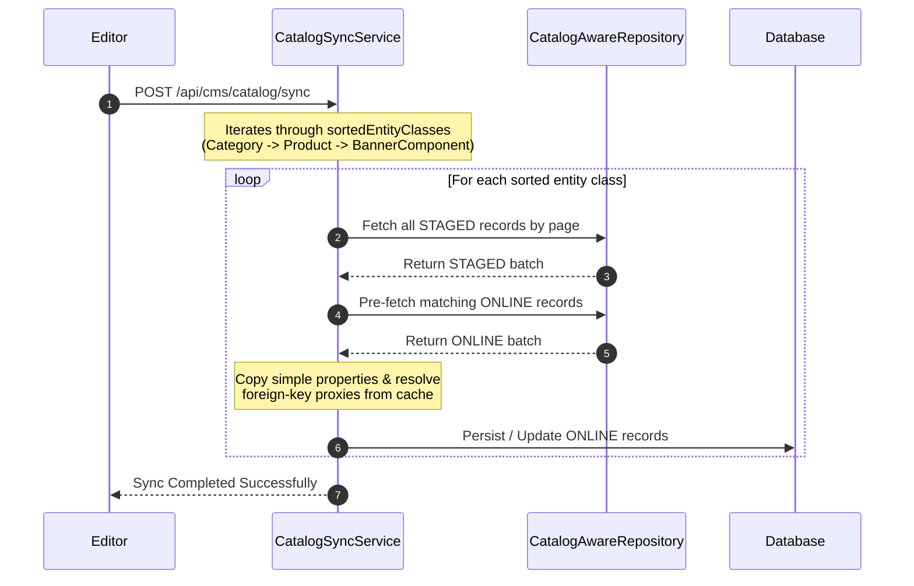

## Table of Contents
{: .no_toc}

* TOC
{:toc}

---

## Introduction

In [Part 4 of the Headless CMS case study](/case-studies/headless-cms-demo-dynamic-forms), we completed our core metadata-driven administration loop, allowing content editors to discover models, list records, and manage data through dynamic Create and Edit forms without writing entity-specific frontend code.

However, modifying records directly in a production database introduces risk. Half-finished edits, unapproved copy, or broken links could immediately impact live storefront shoppers. To isolate editorial work from the live customer experience, our content system uses a dual-catalog pattern:

1. **Staged Catalog**: Where editors create, update, and review work in progress.
2. **Online Catalog**: The read-optimized, authoritative dataset consumed exclusively by the public storefront.

When content teams finish editing a campaign or catalog update, they trigger a synchronization process to publish changes from the Staged catalog to the Online catalog. While copying isolated rows seems straightforward, relational data introduces a complex dependency problem: publishing entities out of order can trigger database foreign-key failures or create broken references on the live storefront.

---

## 1. The Relational Publishing Problem

Consider a standard e-commerce content hierarchy where a `Product` belongs to a `Category`, and a promotional `BannerComponent` points to that `Product`.

```mermaid
flowchart LR
    C[Category: Footwear] <-- belongs to -- P[Product: Running Shoes]
    P <-- links to -- B[BannerComponent: Summer Sale]
```

If an editor creates all three records in the Staged catalog and initiates a sync, what happens if the synchronization engine copies the `Product` to the Online catalog before copying the `Category`?

Depending on your schema constraints, the database will either throw a foreign-key constraint violation or insert an orphaned product pointing to a non-existent category ID. Similarly, syncing the `BannerComponent` before the `Product` exists online will cause live landing pages to render broken call-to-action buttons.

To publish relational graphs safely, the backend must synchronize entities in their exact dependency order: parent entities first, dependent child entities second.

---

## 2. Automated Dependency Discovery via the JPA Metamodel

Hardcoding synchronization order in a service method is error-prone and brittle. Every time an engineer adds a new domain entity or introduces a new association, someone would have to remember to update the publishing pipeline order.

Instead, our `CatalogSyncService` inspects the JPA Metamodel at application startup to discover entity relationships automatically. By examining all managed types that extend our base `CatalogAwareModel`, the service identifies many-to-one and one-to-one associations and records them as directed edges in a dependency graph.

```java
// CatalogSyncService.java (Simplified Dependency Discovery)
private void buildTopologicalSort() {
    Set<Class<? extends CatalogAwareModel>> nodes = new HashSet<>();
    Map<Class<? extends CatalogAwareModel>, Set<Class<? extends CatalogAwareModel>>> adjList = new HashMap<>();
    Map<Class<? extends CatalogAwareModel>, Integer> inDegree = new HashMap<>();

    // 1. Discover all catalog-aware entities
    for (EntityType<?> entityType : entityManager.getMetamodel().getEntities()) {
        Class<?> javaType = entityType.getJavaType();
        if (CatalogAwareModel.class.isAssignableFrom(javaType)) {
            Class<? extends CatalogAwareModel> modelClass = (Class<? extends CatalogAwareModel>) javaType;
            nodes.add(modelClass);
            adjList.put(modelClass, new HashSet<>());
            inDegree.put(modelClass, 0);
        }
    }

    // 2. Build dependency edges
    for (EntityType<?> entityType : entityManager.getMetamodel().getEntities()) {
        Class<?> javaType = entityType.getJavaType();
        if (!CatalogAwareModel.class.isAssignableFrom(javaType)) continue;
        Class<? extends CatalogAwareModel> dependent = (Class<? extends CatalogAwareModel>) javaType;

        for (Attribute<?, ?> attr : entityType.getAttributes()) {
            if (attr.isAssociation() && attr.getPersistentAttributeType() != Attribute.PersistentAttributeType.ONE_TO_MANY) {
                Class<?> targetType = attr.isCollection()
                    ? ((PluralAttribute<?, ?, ?>) attr).getElementType().getJavaType()
                    : attr.getJavaType();

                if (CatalogAwareModel.class.isAssignableFrom(targetType) && !targetType.equals(dependent)) {
                    Class<? extends CatalogAwareModel> dependency = (Class<? extends CatalogAwareModel>) targetType;
                    // Directed edge: dependency -> dependent
                    if (adjList.get(dependency).add(dependent)) {
                        inDegree.put(dependent, inDegree.get(dependent) + 1);
                    }
                }
            }
        }
    }
}
```

In this discovery phase, if `Product` has a `@ManyToOne` association pointing to `Category`, the algorithm records an edge from `Category` to `Product`. This indicates that `Category` is a prerequisite that must be synchronized first.

---

## 3. Resolving Order with Kahn's Algorithm

Once the adjacency list (`adjList`) and in-degree counts are populated, the service executes **Kahn's Algorithm** to compute a valid Directed Acyclic Graph (DAG) topological sort order.

```java
// CatalogSyncService.java (Simplified Kahn's Algorithm)
Queue<Class<? extends CatalogAwareModel>> queue = new LinkedList<>();
for (Class<? extends CatalogAwareModel> node : nodes) {
    if (inDegree.get(node) == 0) {
        queue.add(node);
    }
}

while (!queue.isEmpty()) {
    Class<? extends CatalogAwareModel> current = queue.poll();
    sortedEntityClasses.add(current);

    for (Class<? extends CatalogAwareModel> neighbor : adjList.get(current)) {
        inDegree.put(neighbor, inDegree.get(neighbor) - 1);
        if (inDegree.get(neighbor) == 0) {
            queue.add(neighbor);
        }
    }
}

if (sortedEntityClasses.size() != nodes.size()) {
    throw new IllegalStateException("Circular dependencies detected among CatalogAware models.");
}
```

When the server completes initialization, `sortedEntityClasses` contains the exact sequence required for safe publishing. If developers accidentally introduce a circular dependency (for example, Entity A requires Entity B, which requires Entity A), the algorithm detects that the sorted list size does not match the node count and halts startup immediately with a clear diagnostic message.

### Scalability Boundaries of Runtime Topological Sorting

While auto-discovering dependency graphs via the JPA Metamodel works cleanly for our demonstration project, it is important to define where this approach reaches its limits.

In large-scale enterprise platforms with hundreds of entity classes developed across distributed engineering teams, dynamic in-memory dependency graphing at startup can become a bottleneck or introduce unexpected coupling:

1. **Circular Dependency Fragility**: As domain schemas grow, unintentional circular associations become more common. A single circular reference between two non-critical reporting entities could prevent the entire backend application from starting.
2. **Monolithic Assumption**: This pattern assumes all managed entities live within a single relational database and JPA persistence unit. In microservice architectures, catalog dependencies often cross service boundaries and cannot be resolved through local reflection.
3. **Coarse-Grained Locking**: Topologically sorting and synchronizing entire domain tables sequentially can cause long transaction lock durations on high-volume production databases.

For massive codebases, teams typically replace startup auto-discovery with explicit domain publishing orchestrators, outbox patterns, or bounded-context sync pipelines that process domain aggregates independently.

---

## 4. Generic Entity Merging Across Catalogs

When an editor triggers `/api/cms/catalog/sync`, `CatalogSyncService` iterates over `sortedEntityClasses` sequentially. For each class, it retrieves all records belonging to the Staged catalog and merges or creates their counterparts in the Online catalog.



To avoid N+1 queries during batch processing, the engine loads existing Online records into an in-memory lookup cache keyed by a natural business identifier (`syncKey`). When processing a Staged record, the engine copies simple scalar fields and assigns the target Online catalog reference:

```java
private <T> void copySimpleProperties(T source, T target, Class<?> entityClass) {
    List<String> ignoredProperties = new ArrayList<>(
        List.of("id", "catalog", "createdAt", "updatedAt", "syncVersion")
    );
    // Ignore associations to prevent overwriting managed proxies
    EntityType<?> entityType = entityManager.getMetamodel().entity(entityClass);
    for (Attribute<?, ?> attr : entityType.getAttributes()) {
        if (attr.isAssociation() || attr.isCollection()) {
            ignoredProperties.add(attr.getName());
        }
    }
    BeanUtils.copyProperties(source, target, ignoredProperties.toArray(new String[0]));
}
```

Once scalar values are copied, the engine resolves relational properties (`resolveRelationships`). Because prerequisite entities were already synchronized earlier in the topological loop, their live Online counterparts already exist in the cache. The engine points the Online record's foreign-key associations directly to those cached Online entities before flushing the batch to the database.

### Limitations and Drawbacks of Generic Merging

While generic reflection-based copying removes the need for custom DTO mappers per entity, this abstraction introduces specific engineering trade-offs:

- **Bypassing Lifecycle Hooks**: Custom business logic inside domain setters or `@PreUpdate` hooks can behave unexpectedly when scalar fields are bulk-copied via reflection utilities.
- **Performance Overhead**: Reflection inspection and generic attribute traversal carry a CPU cost that is noticeably slower than compiled, domain-specific mapping code during large data migrations.
- **Collection Orphan Management**: Merging nested collections generically requires careful `retainAll` and index alignment logic to avoid triggering Hibernate orphan-removal exceptions or unintended cascade deletes.

---

## 5. Closing the Loop: Consuming the Published Catalog

Once the topological synchronization finishes, the `ONLINE` catalog becomes the authoritative, read-only data source for the Next.js Storefront.

Because the storefront communicates exclusively with the read-optimized Online API (`/api/pages/{slug}` and `/api/slots/details`), it does not access Staged editorial drafts. When a shopper requests a page, the storefront fetches the layout slots and maps each component payload to a React component using a discriminated union registry:

```tsx
// ComponentRenderer.tsx (Simplified Discriminated Union Lookup)
const componentRegistry: Record<string, React.ComponentType<any>> = {
  BANNER: BannerComponent,
  PARAGRAPH: ParagraphComponent,
  PRODUCT_CAROUSEL: ProductCarouselComponent,
  NAVIGATION: NavigationComponent,
};

export default function ComponentRenderer({ component, product }: ComponentRendererProps) {
  const ComponentToRender = componentRegistry[component.type];
  if (!ComponentToRender) return null;
  return <ComponentToRender {...component} product={product} />;
}
```

Because the frontend resolves component types (`BANNER`, `PRODUCT_CAROUSEL`) dynamically from backend metadata, editors can construct, reorder, and publish rich landing pages without requiring frontend code deploys.

---

## Conclusion

By combining JPA Metamodel inspection with Kahn's topological sorting algorithm, our backend discovers relational publishing constraints automatically at startup.

When content editors publish changes, the synchronization engine processes entities in their exact prerequisite order, resolving foreign-key references against cached Online records. Once synchronized, the Next.js Storefront consumes those published slot configurations and renders them dynamically through a React component registry.

This completes our core five-part implementation of building a modern, metadata-driven headless CMS architecture: from runtime layout composition and self-describing backend schemas to generic UI generation and safe relational publishing.

---

## What's Next?

With our core content management loop complete (from runtime layout composition and self-describing backend schemas to generic UI generation and safe relational publishing), we have a functional, end-to-end metadata-driven architecture.

However, moving a system from an architectural demonstration to an enterprise-grade production platform requires evaluating clear boundaries and identifying where adjacent subsystems belong.

In Part 6 of this series, we will conduct an architectural retrospective evaluating where the metadata-driven CMS succeeds, why adjacent capabilities like authentication, search indexing, and audit logging were intentionally excluded from the core entity model, and how the platform evolves into a modular enterprise ecosystem.
