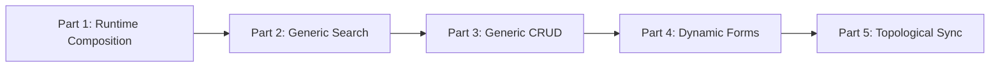
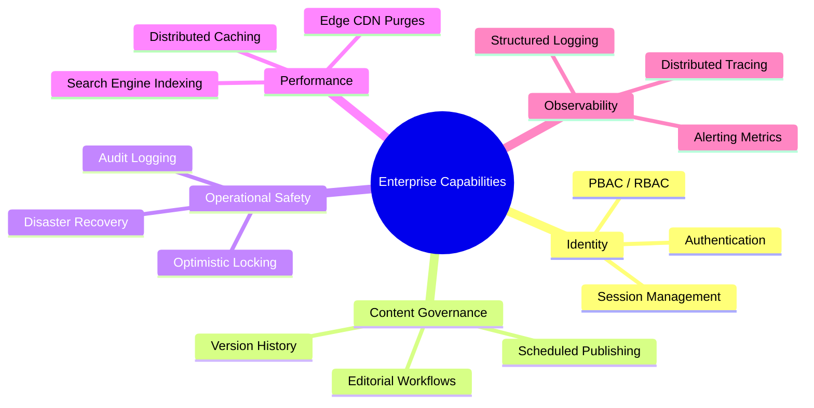
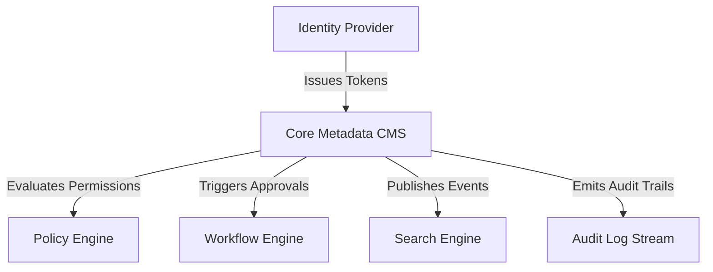

## Table of Contents
{: .no_toc}

* TOC
{:toc}

---

## Introduction

In [Part 5 of the Headless CMS case study](/case-studies/headless-cms-demo-topological-sync), we resolved relational publishing dependencies using Kahn's topological sorting algorithm over the JPA Metamodel, ensuring safe, ordered synchronization between isolated `STAGED` and `ONLINE` catalogs.

With our core five-part implementation complete, our metadata-driven content loop is fully functional: content editors can compose slot-based layouts, discover backend domain models, search across entity references, create or update records via generic forms, and publish relational graphs to a decoupled Next.js storefront.

Rather than introducing another implementation feature, this final article steps back to evaluate the architecture as a whole. We will examine where the metadata-driven approach succeeds, why adjacent enterprise subsystems were deliberately excluded from the core content model, and how an engineering team matures this foundation into a production-grade platform ecosystem.

---

## 1. Recap of the Journey

Over the past five parts of this series, we designed and implemented a headless content management system built around runtime introspection and schema composition:

At this stage, our core demonstration codebase proves that treating schema definitions as runtime metadata allows administration interfaces and publishing pipelines to operate without static domain coupling.

---

## 2. What the Architecture Successfully Demonstrates

When building internal developer platforms, engineering teams often underestimate the value of eliminating repetitive boilerplate across the full stack. Our demonstration codebase validates several core engineering patterns:

### Metadata-Driven Backend Behavior
Instead of writing and maintaining dedicated controllers (`ProductController`, `ArticleController`, `CategoryController`) for every new domain entity, the backend inspects the JPA Metamodel at application startup. Adding a new content entity requires only defining a standard Java class annotated with validation rules.

### Generic Administration UI
The administrative web interface contains zero entity-specific React views. By querying `/api/cms/items/{type}/metadata`, the frontend dynamically constructs data tables, pagination controls, search operators, and complex reference pickers.

### Runtime Layout Composition
By decoupling page structures from fixed backend templates, content editors assemble storefront layouts freely using slotted component blocks (`HEADER_SLOT`, `CONTENT_SLOT`).

### Safe Relational Catalog Publishing
By combining automated dependency discovery with Kahn's topological sorting algorithm, the synchronization engine publishes complex relational graphs from isolated editorial catalogs (`STAGED`) to read-optimized public catalogs (`ONLINE`) in strict prerequisite order.

---

## 3. Why the Project Stops Here

A critical responsibility in software architecture is defining explicit boundaries. The primary objective of this project was exploring the mechanics of a metadata-driven content engine, not constructing a commercial all-in-one suite.

Once the platform demonstrated the ability to model, edit, publish, and render arbitrary content types without UI duplication, the core architectural hypothesis was proven. Continuing to append features to a single demonstration repository would blur the distinction between the metadata engine and the surrounding operational infrastructure.

The remaining work required to run this platform at scale is primarily enterprise hardening rather than introducing fundamentally new content modeling concepts.

---

## 4. Enterprise Capabilities Beyond the Core CMS

At this point, additional engineering effort no longer expands the metadata-driven architecture itself. Instead, it adds capabilities that surround and support the CMS. These concerns are intentionally orthogonal and can evolve independently of the core content engine:

### Identity and Access Governance
- **Authentication**: Verifying user identities via standard token protocols.
- **Granular Authorization (PBAC/RBAC)**: Restricting specific editors to specific entities or locales.
- **Session Security**: Managing token expiration and revocation.

### Content Governance
- **Version History**: Storing immutable snapshots of past entity revisions.
- **Approval Workflows**: Multi-stage review gates before changes enter the Staged catalog.
- **Scheduled Publishing**: Asynchronous background jobs that execute catalog synchronization at specified timestamps.

### Operational Safety
- **Audit Logs**: Recording an immutable ledger tracking which user modified a field at a specific timestamp.
- **Optimistic Locking**: Enforcing entity version checks (`@Version`) to prevent concurrent editors from overwriting each other's work silently.

### Performance and Delivery
- **Dedicated Search Indexing**: Mirroring catalog data into inverted-index search engines.
- **Edge CDN Invalidation**: Emitting cache-purge webhooks to global edge networks immediately after catalog synchronization completes.

---

## 5. Why Adjacent Subsystems Were Deliberately Excluded

Enterprise software is increasingly assembled from specialized subsystems rather than implemented as a single monolithic application. Authentication, policy evaluation, search indexing, workflow orchestration, and audit logging each solve distinct problems and often evolve on different lifecycles from the CMS itself:

### Authentication is an External Concern
Modern backend platforms rarely implement custom password storage or user tables. Identity management is handled by specialized OAuth2 and OpenID Connect providers. Integrating authentication in production simply requires configuring Spring Security as a resource server that validates JWT bearer tokens issued by the identity provider.

### Search Deserves a Specialized Storage Engine
While relational database queries (`LIKE` clauses) work sufficiently for small demonstration datasets, high-volume storefront search requires specialized data structures. Sub-millisecond faceted filtering, typo tolerance, and relevance scoring belong in dedicated search systems synchronized asynchronously via domain events.

### Governance and Audit are Orthogonal Workflows
Building complex multi-step state machines or append-only audit ledgers directly inside the `ItemModel` class hierarchy violates the single responsibility principle. Audit trails are best captured transparently through database interceptors or outbox change-data-capture (CDC) streams without polluting core content entities.

---

## 6. Where the Architecture Can Evolve

As systems grow, the CMS gradually shifts from being a standalone application into one subsystem within a larger platform. Rather than embedding every enterprise capability into the same codebase, responsibilities are delegated to specialized services:

Because architecture ages slower than concrete technologies, keeping subsystem interfaces decoupled allows engineering teams to plug in appropriate industry tools as requirements evolve:
- **Identity Providers** handle SSO and directory management independently.
- **Policy Engines** evaluate fine-grained access rules without modifying CMS backend controllers.
- **Workflow Engines** orchestrate multi-step editorial sign-offs and long-running timers.
- **Search Engines** serve read-heavy storefront queries on dedicated hardware clusters separated from the primary transactional database.

---

## 7. Engineering Observations

Reflecting on the real-world experience of building this system reveals several practical surprises and trade-offs:

- **Reflection Overhead Was Negligible at Startup**: Introspection and Java reflection are frequently criticized for performance penalties. However, when confined strictly to application startup to build static type registries, the runtime cost is imperceptible.
- **Frontend Complexity Exceeded Backend Complexity**: Deriving schema structures on the backend required straightforward JPA Metamodel inspection. Conversely, rendering dynamic forms on the frontend required carefully balancing generic input rendering with a usable layout.
- **API Clarity Over Extreme Abstraction**: The most challenging balance was not generating generic CRUD tables, but keeping metadata payload schemas legible so frontends could consume them predictably.

---

## 8. Lessons Learned and Engineering Trade-Offs

Summarizing our core architectural takeaways:

1. **Keep Reflection Off Hot Paths**: Discovering metadata at startup is clean and safe. Executing unbuffered reflection inside high-throughput API request loops should always be avoided.
2. **Metadata Reduces Duplication at the Expense of Abstraction**: Eliminating boilerplate controllers and React pages reduces maintenance overhead. Conversely, highly abstract systems present a steeper initial learning curve when debugging unexpected UI rendering behavior.
3. **Know When Not to Generalize**: A generic form generator works exceptionally well for structured administrative data. Attempting to force interactive consumer funnels (such as multi-step checkout wizards) into a generic schema engine creates unnecessary friction.

---

## 9. Conclusion

This project intentionally stops where the metadata-driven architecture reaches a natural boundary. Beyond this point, enterprise capabilities such as identity, policy evaluation, workflow, search, and observability become reusable platform services in their own right. Exploring those domains deserves separate projects rather than continuing to expand the CMS itself.

Once our platform could describe its own domain models, generate administrative interfaces, synchronize relational catalogs safely, and render storefront pages dynamically, the architectural experiment reached its intended destination.
