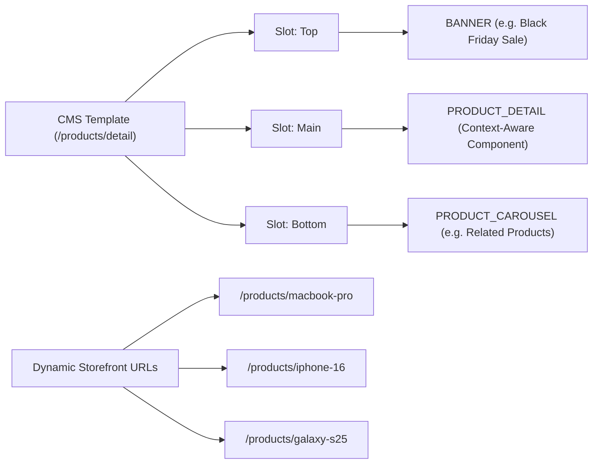

## The Premise

Enterprise CMS platforms are often massive, doing everything from complex workflow approvals to multi-region content synchronization. But at their core, what most developers want is a way for editors to compose pages using a flexible component system, while keeping the frontend entirely decoupled.

I recently built a [Headless CMS Demo Application](https://github.com/adiputera/demo-cms-storefront) from scratch using Java 25, Spring Boot 4.0, and Next.js. Rather than focusing on production readiness, the project was designed to prototype five core architectural patterns:

1. **Two-Stage Catalogs & Read/Write Separation**
2. **Polymorphic Component Modeling in JPA**
3. **Dynamic Schema-Driven Admin Forms**
4. **Product Detail Template Patterns**
5. **Runtime Page Composition in Next.js**

Instead of hardcoding layouts in the frontend, the CMS dictates what components appear in which "slots." The frontend simply fetches the schema, maps the component types to a registry, and renders them dynamically. This means content editors can add a carousel, banner, or text block to a page, and the storefront adapts instantly—no code changes, no frontend redeploys.

Here is a look at the technical decisions that made this work cleanly.

## The Architecture: Two-Stage Catalogs and Read/Write Separation

One of the biggest pain points in coupled architectures is that administrative actions compete for the same resources as public storefront traffic, and work-in-progress content often leaks to the live site. To avoid this, I implemented a **Catalog-Aware Schema** combined with backend service splitting. *(Note: This pattern is applied to both the Content Catalog for pages and components, and the Product Catalog for merchandising data).*


*   **Storefront Backend (Port 8080):** A highly optimized, read-only API layer scoped strictly to the `ONLINE` catalog. It talks to the database but aggressively caches everything in Redis. It uses `@Transactional(readOnly=true)` and `JOIN FETCH` queries to prevent N+1 issues when eager-loading components.
*   **CMS Backend (Port 8081):** A write-heavy administrative API scoped to the `STAGED` catalog. This is where content mutations happen (Create/Update/Delete), safely hidden from the public.

This read/write service separation keeps things incredibly simple. Editors work exclusively in the `STAGED` environment. 

### The Synchronization Engine

When a page is ready for production, editors trigger an automated "Sync to Online" operation. This is arguably the most unique part of the architecture, heavily inspired by enterprise systems like SAP Commerce.

Because the CMS supports complex nested relationships (e.g., a Page has Slots, Slots have Components, Components might reference Products or Images), you cannot simply execute a raw SQL copy without violating foreign key constraints. 

To ensure referential integrity during the deep copy, the `CatalogSyncService` builds a dependency graph of all `CatalogAwareModel` entities at startup. It uses **Kahn's Algorithm** to perform a topological sort, guaranteeing that independent entities (like Products) are synced before the entities that depend on them (like Product Carousel Components). By flipping the mental "top-down" editor configuration (`Page -> Slot -> Component`) into a "bottom-up" relational insertion order (`Product -> Component -> Slot -> Page`), the algorithm gracefully bypasses foreign-key constraints during the deep copy.

```java
// CatalogSyncService.java (Simplified)
@Transactional
public void syncCatalog(String catalogId) {
    Catalog staged = catalogRepository.findByCatalogIdAndVersion(catalogId, CatalogVersion.STAGED);
    Catalog online = catalogRepository.findByCatalogIdAndVersion(catalogId, CatalogVersion.ONLINE);

    // sortedEntityClasses is resolved at startup via topological sort
    // e.g. Sync Order: Product -> Component -> Slot -> Page
    for (Class<? extends CatalogAwareModel> entityClass : sortedEntityClasses) {
        syncEntityClass(entityClass, staged, online, syncedCache);
    }
}
```

During this synchronization, the CMS Backend runs targeted `@CacheEvict` commands against Redis to invalidate the storefront's cache:

```java
// CMS Backend (Write API) - CatalogController
@PostMapping("/api/sync/{catalogId}")
@CacheEvict(value = {"page", "slot", "products"}, allEntries = true)
public ResponseEntity<Void> syncCatalog(@PathVariable String catalogId) {
    catalogSyncService.syncCatalog(catalogId);
    return ResponseEntity.ok().build();
}
```

It's worth noting the architectural tradeoffs made here. Using `allEntries = true` trades caching efficiency for implementation simplicity. Evicting the entire cache on sync means publishing one page invalidates all other pages—a blast-radius tradeoff accepted for this prototype. Furthermore, this cross-service eviction relies on both the CMS and Storefront applications sharing the same Redis connection and Spring Cache key configuration.

Despite this broad eviction, the next time a customer hits the Storefront Backend for that content, it registers a cache miss, fetches the newly synced `ONLINE` data from the Database, and caches it again (usually with a 15-to-30-minute TTL). This provides immediate consistency for the editor upon publishing, blazing fast reads for the user, and zero risk of exposing half-finished pages.

## Core Design 1: Polymorphic Component Modeling in JPA

A flexible CMS needs to support various component types (e.g., `BANNER`, `PARAGRAPH`, `PRODUCT_CAROUSEL`). Storing these cleanly in a relational database can be tricky. You generally have three options: a massive table with nullable columns, a JSON blob column, or table inheritance.

I opted for JPA's `JOINED` inheritance strategy. This gives us a clean base `components` table containing shared fields (`id`, `uid`, `sort_order`, `type`, `slot_id`), and separate subclass tables for specific fields (e.g., `banner_components` has `image_url` and `cta_url`).

```java
@Entity
@Table(name = "components")
@Inheritance(strategy = InheritanceType.JOINED)
@DiscriminatorColumn(name = "type")
public abstract class Component {
    @Id
    @GeneratedValue(strategy = GenerationType.IDENTITY)
    private Long id;
    
    private String uid;
    private Integer sortOrder;
    
    @ManyToOne(fetch = FetchType.LAZY)
    @JoinColumn(name = "slot_id")
    private Slot slot;
    
    public abstract ComponentType getType();
}
```

```java
@Entity
@Table(name = "banner_components")
@CmsComponent(displayName = "Hero Banner", description = "Image banner with title, subtitle, and CTA button")
public class BannerComponent extends Component {
    
    @Column(name = "image_url")
    @CmsField(displayName = "Image URL", type = "image", required = true)
    private String imageUrl;
    
    @Column(name = "title")
    @CmsField(displayName = "Title", type = "string", required = true)
    private String title;
    
    @Column(name = "cta_url")
    @CmsField(displayName = "CTA URL", type = "string", required = false)
    private String ctaUrl;
    
    @Override
    public ComponentType getType() { return ComponentType.BANNER; }
}
```

This ensures referential integrity and strict typing at the database level, unlike dumping everything into a JSONB column. While `JOINED` inheritance does introduce a performance tradeoff—requiring an SQL `JOIN` per subclass on every fetch—this read cost is entirely offset by our aggressive Redis caching layer on the storefront API.

When returning data through the APIs, we use Jackson's `@JsonTypeInfo` and `@JsonSubTypes` to automatically serialize and deserialize the correct subclasses based on the `type` field. This means the frontend receives strongly typed JSON payloads without the backend needing massive `switch` statements during serialization.

### Typing Polymorphism in Next.js

On the Next.js frontend, this polymorphic JSON payload is elegantly modeled using **TypeScript Discriminated Unions**. By defining a literal `type` on each interface, TypeScript can automatically narrow the specific component type at compile-time:

```typescript
// storefront-frontend/src/types/index.ts
export type ComponentType = 'BANNER' | 'PARAGRAPH' | 'PRODUCT_CAROUSEL' | 'PRODUCT_DETAIL';

export interface BaseComponent {
  type: ComponentType;
  id: number;
  uid: string;
}

export interface BannerComponent extends BaseComponent {
  type: 'BANNER'; // Discriminator literal
  imageUrl: string;
  title: string;
  ctaUrl: string;
}

export interface ParagraphComponent extends BaseComponent {
  type: 'PARAGRAPH';
  content: string;
}

// Discriminated Union
export type Component = 
  | BannerComponent 
  | ParagraphComponent 
  | ProductCarouselComponent 
  | ProductDetailComponent;
```

Because of this strict typing, when the Next.js `ComponentRenderer` iterates through the list of generic components and maps them to their respective React components, the props passed to them are completely type-safe without needing any manual casting.

## Core Design 2: Dynamic Schema-Driven Admin Forms

A common friction point in headless CMS development is that every time you invent a new component type (say, a `VideoPlayer`), you have to write a custom React form in the admin panel to let editors configure it.

To bypass this, the CMS relies on **Dynamic Schema-Driven Form Generation** powered by reflection. Notice the `@CmsComponent` and `@CmsField` annotations in the `BannerComponent` snippet above. On the backend, developers simply annotate their entity fields, and at startup, a `ComponentSchemaService` discovers these components automatically using the JPA Metamodel:

```java
// ComponentSchemaService.java (Simplified)
@PostConstruct
public void init() {
    for (EntityType<?> entityType : entityManager.getMetamodel().getEntities()) {
        Class<?> javaType = entityType.getJavaType();
        
        if (Component.class.isAssignableFrom(javaType) && javaType.isAnnotationPresent(CmsComponent.class)) {
            CmsComponent componentMetadata = javaType.getAnnotation(CmsComponent.class);
            // Build Schema Fields dynamically via Reflection...
            for (Field field : javaType.getDeclaredFields()) {
                if (field.isAnnotationPresent(CmsField.class)) {
                    CmsField fieldMetadata = field.getAnnotation(CmsField.class);
                    // Add to schema registry
                }
            }
        }
    }
}
```

The admin UI then makes a call to the backend (`/api/cms/components/types`), which returns the exact fields required for that component as JSON. 

The frontend then loops through this schema, dynamically rendering text inputs, rich textareas, checkboxes, or searchable multi-selects based on the metadata. 

```tsx
// cms-frontend/.../ComponentFormModal.tsx
const renderDynamicFields = () => {
  if (!schema || !schema.fields) return null;

  return (
    <div className="space-y-4">
      {schema.fields.map((field: any) => (
        <div key={field.name} className="field-group">
          <label>
            {field.displayName} {field.required && <span className="text-red-500">*</span>}
          </label>
          
          {field.type === 'text' ? (
            <textarea
              value={fields[field.name] || ''}
              onChange={(e) => setFields({ ...fields, [field.name]: e.target.value })}
              required={field.required}
              placeholder={field.placeholder}
            />
          ) : field.type === 'multiple_products' ? (
            <div className="space-y-2 mt-2">
              <input
                type="text"
                placeholder="Search products..."
                value={productSearch}
                onChange={(e) => setProductSearch(e.target.value)}
                className="w-full px-3 py-2 border border-gray-300 rounded-md text-sm mb-2"
              />
              <div className="max-h-60 overflow-y-auto border border-gray-200 rounded-md p-2 bg-gray-50">
                {/* In a real system, this would fetch paginated data from an API */}
                {products.filter(p => p.name.toLowerCase().includes(productSearch.toLowerCase()))
                  .map(p => {
                    const isChecked = (fields[field.name] || []).includes(p.code);
                    return (
                      <label key={p.id} className="flex items-start space-x-3 cursor-pointer p-1">
                        <input
                          type="checkbox"
                          checked={isChecked}
                          onChange={(e) => {
                            const selected = fields[field.name] || [];
                            setFields({
                              ...fields, 
                              [field.name]: e.target.checked 
                                ? [...selected, p.code] 
                                : selected.filter((c: string) => c !== p.code)
                            });
                          }}
                        />
                        <span className="text-sm">{p.name}</span>
                      </label>
                    );
                })}
              </div>
            </div>
          ) : field.type === 'boolean' ? (
            <input
              type="checkbox"
              checked={!!fields[field.name]}
              onChange={(e) => setFields({ ...fields, [field.name]: e.target.checked })}
            />
          ) : field.type === 'image' ? (
            <div className="mt-2">
              <ImageUploader
                value={fields[field.name] || ''}
                onChange={(url) => setFields({ ...fields, [field.name]: url })}
                placeholder={field.placeholder}
              />
            </div>
          ) : (
            <input
              type="text"
              value={fields[field.name] || ''}
              onChange={(e) => setFields({ ...fields, [field.name]: e.target.value })}
              required={field.required}
              placeholder={field.placeholder}
            />
          )}
        </div>
      ))}
    </div>
  );
};
```

Because this frontend code is completely agnostic to the specific component types, if I add a `VideoPlayer` entity to the backend tomorrow, the admin UI automatically knows how to render a configuration form for it. As long as the field types are known to the frontend registry, this eliminates the need to update the admin frontend codebase when adding new components. If a new, unknown field type is introduced, then UI development is required to map that type to a React component.

For complex field types, the schema-driven approach is equally powerful. By simply setting `@CmsField(type = "image")` on a component entity's backend property, the CMS Admin UI is instructed to substitute a standard text input with a rich, drag-and-drop React `ImageUploader` component.

## Core Design 3: The Product Detail Template Pattern

Hardcoding product detail pages (PDPs) is a common mistake in early-stage storefronts. If marketing wants to add a promotional banner to the MacBook Pro page, developers usually have to deploy a code change.

In this architecture, Product Detail Pages (`/products/[code]`) are mapped to a single CMS page layout template.



We use a generic `/products/detail` page slug in the CMS as the master template. This allows editors to drag and drop standard components (banners, text blocks, carousels) around the main `PRODUCT_DETAIL` component.

At runtime, the storefront router intercepts a request for `/products/macbook-pro`. It fetches the `/products/detail` template from the CMS, fetches the product data for `macbook-pro` from the catalog, and binds that data context to the child `PRODUCT_DETAIL` component. 

If marketing wants to add a Black Friday banner above all products, they simply add a `BANNER` component to the top slot of the template in the CMS. Every product page across the entire catalog updates instantly.

## Core Design 4: Runtime Page Composition in Next.js

The magic happens on the public storefront. The Next.js app knows absolutely nothing about the layout of a page. 

When a user visits `/about-us`, the Next.js app hits the Storefront API. To avoid N+1 network requests, it does this in two steps:
1. Fetch the page metadata and available slots (`GET /api/pages/about-us`).
2. Batch fetch all components for those slots (`POST /api/slots/details`).

By leveraging Next.js React Server Components (RSC), these fetches happen entirely on the server, avoiding client-side waterfalls. 

In Next.js, we maintain a strict `ComponentRegistry`. When iterating over the components payload, the frontend dynamically loads the corresponding React component based on the `type` string.

```tsx
// ComponentRegistry.tsx
import dynamic from 'next/dynamic';

const componentRegistry = {
  BANNER: dynamic(() => import('./components/BannerComponent')),
  PARAGRAPH: dynamic(() => import('./components/ParagraphComponent')),
  PRODUCT_CAROUSEL: dynamic(() => import('./components/ProductCarouselComponent')),
  PRODUCT_DETAIL: dynamic(() => import('./components/ProductDetailComponent')),
};

export default function ComponentRenderer({ component }) {
  const ComponentClass = componentRegistry[component.type];
  
  if (!ComponentClass) {
    return <div className="error print-no-link">Unknown component: {component.type}</div>;
  }
  
  return <ComponentClass data={component} />;
}
```

This is true decoupled architecture. The editor drops a `PRODUCT_CAROUSEL` into the "Hero" slot of the homepage via the admin UI and clicks "Sync to Online". The backend synchronizes the catalog, the storefront cache is evicted, and the very next visitor gets the new JSON payload. Next.js renders the carousel seamlessly—all without a single line of frontend code changing or deploying.


## The Takeaway

Building a full-scale CMS is an immense undertaking, but prototyping the core mechanics reveals a lot about architectural trade-offs. 

By aggressively decoupling the read/write paths, leaning into JPA's polymorphic mapping for strict database typing, implementing template-driven pages, and relying on runtime dynamic rendering on the frontend, you get an incredibly resilient and flexible system. The frontend becomes a pure presentation layer, the database enforces strict schemas, and the CMS administration panel dictates the experience dynamically.

### What I Would Change

If this architecture evolved beyond a prototype into a production product, a few core areas would need immediate refactoring. For production deployment, I would opt for the more robust architectural patterns below, but since this is just a working concept demo, pragmatic shortcuts were taken to illustrate the core flow:

1. **Event-Driven Cache Eviction**: I would implement an event-driven webhook pattern (using Kafka or Redis Pub/Sub) where the CMS Backend publishes a `CatalogSyncedEvent`. This allows the Storefront API to manage its own cache eviction and preserves true service autonomy, replacing the direct `@CacheEvict` shortcut currently used.
2. **Workflow Approvals**: The Two-Stage catalog is a great foundation, but enterprise teams require an `IN_REVIEW` stage with role-based access control (RBAC) before syncing to `ONLINE`.
3. **Build-Time Metadata Scanning**: I would use an Annotation Processor to generate the schema definitions at compile-time to align better with Spring's Ahead-Of-Time (AOT) compilation and GraalVM Native Image optimizations, replacing the runtime Java Reflection scanning (`@PostConstruct`).

It's one thing to use a Headless CMS, but engineering one from scratch forces you to respect the complexity hiding behind the "Publish" button.
