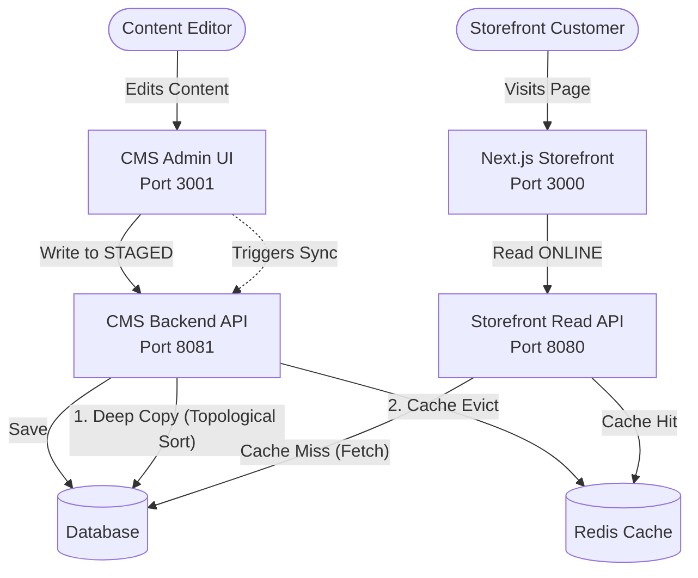
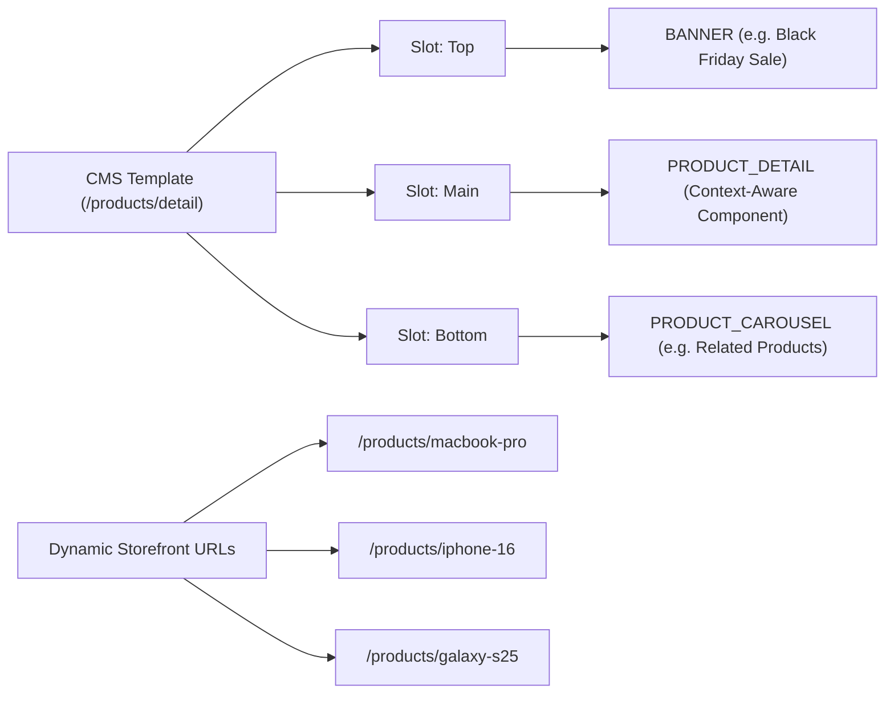
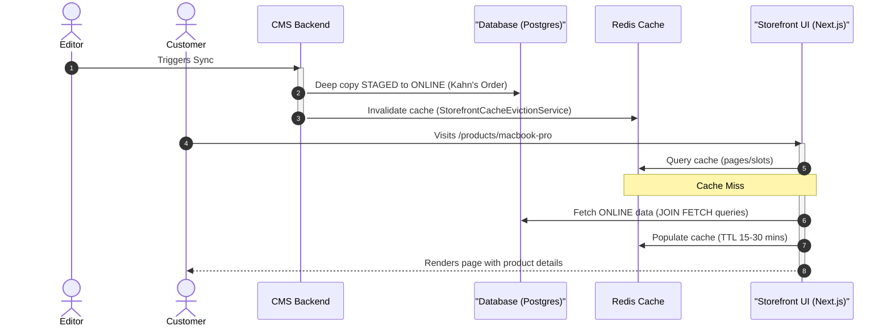
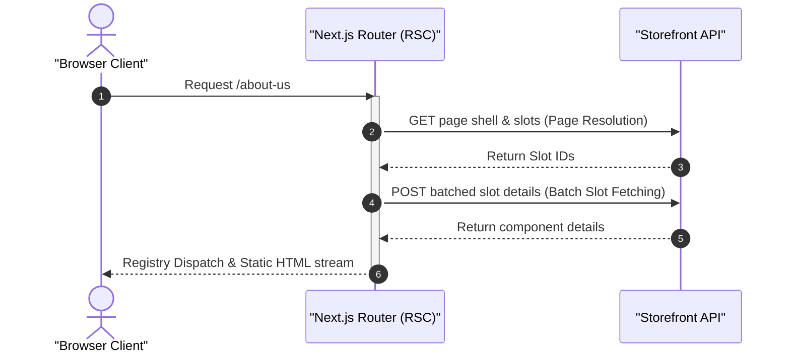

## Table of Contents
{: .no_toc}

* TOC
{:toc}

---

## The Background

Most headless CMS tutorials stop at basic CRUD APIs and static content rendering. They rarely explore the architectural problems that emerge once editors expect production-like capabilities: staged publishing, reusable page composition, runtime schema discovery, and metadata-driven administration interfaces. 

Rather than attempting to build a production-ready system, this project serves as a Proof of Concept (PoC) or simulation. I focused on addressing five fundamental architectural problems that commonly appear in enterprise content platforms in a pragmatic way:

1. **Two-Stage Catalogs & Read/Write Separation**
2. **Polymorphic Component Modeling in JPA**
3. **Dynamic Schema-Driven Form Generation**
4. **Product Detail Template Patterns**
5. **Runtime Page Composition in Next.js**

By structuring the CMS around these problems, I eliminated hardcoded frontend layouts. Instead, the CMS dictates what components appear in which "slots." The storefront dynamically resolves the content, maps the component types to a local registry, and renders them. This allows content editors to add a carousel, banner, or text block to a page, and the storefront adapts without frontend redeploys (provided the component type and its fields are already registered in the storefront's registry).

To demonstrate these concepts in action, I built a [Headless CMS Demo Application](https://github.com/adiputera/demo-cms-storefront) using the latest Java and Spring Boot (Java 25 and Spring Boot 4.0) alongside Next.js. This case study covers the architecture and the design trade-offs I made.

## The Architecture: Two-Stage Catalogs and Read/Write Separation

One of the biggest pain points in coupled architectures is that administrative actions compete for the same resources as public storefront traffic, and work-in-progress content often leaks to the live site. To avoid this, I implemented a **Catalog-Aware Schema** combined with backend service splitting. *(Note: This pattern is applied to both the Content Catalog for pages and components, and the Product Catalog for merchandising data).*



*   **Storefront Backend (Port 8080):** A read-optimized API layer scoped strictly to the `ONLINE` catalog. It talks to the database but utilizes a Redis caching layer. It uses `@Transactional(readOnly=true)` and `JOIN FETCH` queries to prevent N+1 issues when eager-loading components.
*   **CMS Backend (Port 8081):** A write-heavy administrative API scoped to the `STAGED` catalog. This is where content mutations happen (Create/Update/Delete), safely hidden from the public.

This read/write service separation keeps the boundary clear. Editors work exclusively in the `STAGED` environment. 

### The Synchronization Engine

When a page is ready for production, editors trigger an automated "Sync to Online" operation. This is arguably the most unique part of the architecture.

Because the CMS supports complex nested relationships (e.g., a Page has Slots, Slots have Components, Components might reference Products or Images), you cannot simply execute a raw SQL copy without violating foreign key constraints. 

To ensure referential integrity during the deep copy, the `CatalogSyncService` builds a dependency graph of all `CatalogAwareModel` entities at startup. It uses **Kahn's Algorithm** to perform a topological sort, guaranteeing that independent base entities (like Products) are synced before the entities that depend on them (like Components, Slots, and Pages). *(Note: This demo operates under a directed acyclic graph (DAG) model, where circular references between components are intentionally left out of scope).*

```text
Dependency Tree (Top-Down Editor Config)
Page
 └── Slots
      └── Components
           └── Products (e.g. for Carousels)

↓

Resolved Sync Order (Bottom-Up Relational Insertion)
Product ──> Component ──> Slot ──> Page
```

By resolving the top-down content composition hierarchy into a relation-safe database insertion order, the sort algorithm guarantees that dependent child records are never inserted before their parent references.

```java
// CatalogSyncService.java (Simplified)
@Transactional
public void syncCatalog(String catalogId) {
    Catalog staged = catalogRepository.findByCatalogIdAndVersion(catalogId, CatalogVersion.STAGED);
    Catalog online = catalogRepository.findByCatalogIdAndVersion(catalogId, CatalogVersion.ONLINE);

    // sortedEntityClasses is resolved at startup via topological sort
    // e.g. Sync Order: Product -> Component -> Slot -> Page
    for (Class<? extends CatalogAwareModel> entityClass : sortedEntityClasses) {
        syncEntityClass(entityClass, staged, online, syncedCache);
    }
}
```
Upon completing a catalog synchronization (both universal and single-item sync) in the CMS Backend, the system invalidates the storefront's cache by directly deleting keys from the shared Redis instance. Since cache invalidation spans two independent Spring Boot applications (the CMS backend on port 8081 and the Storefront backend on port 8080), direct Redis key deletion was used instead of local Spring Cache annotations. This is managed by a dedicated `StorefrontCacheEvictionService` called after the sync transaction completes:

```java
// StorefrontCacheEvictionService.java
@Service
@RequiredArgsConstructor
public class StorefrontCacheEvictionService {
    private final StringRedisTemplate redisTemplate;

    public void evictStorefrontCaches() {
        evictByPattern("pages::*");
        evictByPattern("slots::*");
        evictByPattern("products::*");
    }

    private void evictByPattern(String pattern) {
        // Note: redisTemplate.keys() is used here for structural simplicity in this demo.
        // In a live production environment, non-blocking SCAN commands should be used to avoid blocking the Redis event loop.
        Set<String> keys = redisTemplate.keys(pattern);
        if (keys != null && !keys.isEmpty()) {
            redisTemplate.delete(keys);
        }
    }
}
```

Evicting the entire cache pattern trades caching efficiency for implementation simplicity. Deferring the storefront cache eviction until the final synchronization to `ONLINE` completes ensures that work-in-progress edits in the `STAGED` catalog do not cause premature cache misses or database hits for customers viewing the active site.

Once the cache is evicted after sync, the next customer request hits the storefront, registers a cache miss, fetches the newly synced `ONLINE` data from the database, and caches it again. This isolation keeps administrative write traffic isolated from storefront read traffic at the application layer, even though they share database and cache instances.

## Core Design 1: Polymorphic Component Modeling in JPA

A flexible CMS needs to support various component types (e.g., `BANNER`, `PARAGRAPH`, `PRODUCT_CAROUSEL`). Storing these cleanly in a relational database can be tricky. You generally have three options: a massive table with nullable columns, a JSON blob column, or table inheritance.

I opted for JPA's `JOINED` inheritance strategy. This provided a clean base `components` table containing shared fields (`id`, `uid`, `name`, `type`), separate subclass tables for specific fields (e.g., `banner_components` has `image_url` and `cta_url`), and a join table `slot_components` mapping components to slots with a `sort_order` column.

```java
@Entity
@Table(name = "components")
@Inheritance(strategy = InheritanceType.JOINED)
public abstract class Component extends CatalogAwareModel {
    private String uid;
    private String name;
    private String type;
    
    @PrePersist
    @Override
    protected void onCreate() {
        super.onCreate();
        if (type == null) {
            type = getType().name();
        }
    }
    
    public abstract ComponentType getType();
    
    @Override
    public String getSyncKey() { return uid; }
}
```

```java
@Entity
@Table(name = "banner_components")
@CmsComponent(displayName = "Hero Banner", description = "Image banner with title, subtitle, and CTA button")
public class BannerComponent extends Component {
    
    @Column(name = "image_url")
    @CmsField(
        displayName = "Image URL",
        type = CmsFieldType.IMAGE,
        required = true
    )
    private String imageUrl;
    
    @Column(name = "title")
    @CmsField(
        displayName = "Title",
        type = CmsFieldType.STRING,
        required = true
    )
    private String title;
    
    @Column(name = "cta_url")
    @CmsField(
        displayName = "CTA URL",
        type = CmsFieldType.STRING,
        required = false
    )
    private String ctaUrl;
    
    @Override
    public ComponentType getType() { return ComponentType.BANNER; }
}
```

The `@CmsField` annotation is the primary metadata contract between the backend and the CMS Admin UI. It describes how a field should be presented, validated, and interpreted by generic tooling. The `CmsFieldType` enum defines the semantic meaning of the field (for example, `STRING`, `NUMBER`, `IMAGE`, or `REFERENCE`), allowing the frontend to render appropriate controls without hardcoded forms:

```java
public enum CmsFieldType {
    STRING,
    NUMBER,
    BOOLEAN,
    IMAGE,
    REFERENCE
    .....
}
```

This ensures referential integrity and strict typing at the database level, unlike dumping everything into a JSONB column. While `JOINED` inheritance does introduce a performance tradeoff—requiring an SQL `JOIN` per subclass on every fetch—this read cost is mitigated by the Redis caching layer on the storefront API. Instead of storing the slots reference on the component itself, the codebase decouples them by using a `slot_components` join table mapped in `Slot` via `@ManyToMany` with `@OrderColumn(name = "sort_order")` keeping components ordered.

When returning data through the APIs, I used Jackson's `@JsonTypeInfo` and `@JsonSubTypes` to automatically serialize and deserialize the correct subclasses based on the `type` field. This means the frontend receives strongly typed JSON payloads without the backend needing massive `switch` statements during serialization.

### Typing Polymorphism in Next.js

On the Next.js frontend, this polymorphic JSON payload is mapped using **TypeScript Discriminated Unions**. By defining a literal `type` on each interface, TypeScript can automatically narrow the specific component type at compile-time:

```typescript
// storefront-frontend/src/types/index.ts
export type ComponentType = 'BANNER' | 'PARAGRAPH' | 'PRODUCT_CAROUSEL' | 'NAVIGATION' | 'QUICK_MENU' | 'PRODUCT_DETAIL';

export interface BaseComponent {
  type: ComponentType;
  id: number;
  uid: string;
  name: string;
  sortOrder: number;
}

export interface BannerComponent extends BaseComponent {
  type: 'BANNER'; // Discriminator literal
  imageUrl: string;
  title: string;
  ctaUrl: string;
}

export interface ParagraphComponent extends BaseComponent {
  type: 'PARAGRAPH';
  content: string;
}

// Discriminated Union
export type Component = 
  | BannerComponent 
  | ParagraphComponent 
  | ProductCarouselComponent 
  | ProductDetailComponent
  | NavigationComponent
  | QuickMenuComponent;
```

Because of this strict typing, when the Next.js `ComponentRenderer` iterates through the list of generic components and maps them to their respective React components, the props passed to them are type-safe without needing any manual casting.

## Core Design 2: Dynamic Schema-Driven Admin Forms

A common friction point in headless CMS development is that every time you invent a new component type (say, a `VideoPlayer`), you have to write a custom React form in the admin panel to let editors configure it.

To bypass this, the CMS relies on **Dynamic Schema-Driven Form Generation** powered by reflection. Notice the `@CmsComponent` and `@CmsField` annotations in the `BannerComponent` snippet above. On the backend, developers simply annotate their entity fields, and at startup, a `ComponentSchemaService` discovers these components automatically using the JPA Metamodel:

```java
// ComponentSchemaService.java (Simplified)
@PostConstruct
public void init() {
    for (EntityType<?> entityType : entityManager.getMetamodel().getEntities()) {
        Class<?> javaType = entityType.getJavaType();
        
        if (Component.class.isAssignableFrom(javaType) && javaType.isAnnotationPresent(CmsComponent.class)) {
            CmsComponent componentMetadata = javaType.getAnnotation(CmsComponent.class);
            // Build Schema Fields dynamically via Reflection...
            for (Field field : javaType.getDeclaredFields()) {
                if (field.isAnnotationPresent(CmsField.class)) {
                    CmsField fieldMetadata = field.getAnnotation(CmsField.class);
                    // Add to schema registry
                }
            }
        }
    }
}
```

The admin UI queries the backend list of component types via `/api/cms/components/types` and fetches the specific field requirements for the selected component via `/api/cms/components/types/{type}/schema`.

The frontend maps these schema fields to form components dynamically:

```tsx
// cms-frontend/.../ComponentFormModal.tsx (Simplified Dynamic Field Mapper)
const renderDynamicFields = () => (
  <div className="space-y-4">
    {schema?.fields.map((field) => (
      <div key={field.name} className="flex flex-col gap-1 text-sm">
        <label className="font-semibold">{field.displayName}</label>
        {field.type === 'image' ? (
          <ImageUploader value={fields[field.name]} onChange={(url) => setFields({ ...fields, [field.name]: url })} />
        ) : (
          <input type="text" value={fields[field.name]} onChange={(e) => setFields({ ...fields, [field.name]: e.target.value })} />
        )}
      </div>
    ))}
  </div>
);
```

Because this form renderer is schema-driven and agnostic to specific component domains, adding a new component (like a `VideoPlayerComponent`) only requires creating the backend Java entity with correct annotations. As long as the field types (like strings, booleans, and image paths) are already known to the frontend registry, there is no need to update the admin frontend codebase. If a new, unknown field type is introduced, frontend development is only required once to map that specific field type to a React component.

By simply setting `@CmsField(type = CmsFieldType.IMAGE)` on a component entity's backend property, the CMS Admin UI is instructed to substitute a standard text input with a rich, drag-and-drop React `ImageUploader` component.

## Core Design 3: The Product Detail Template Pattern

Hardcoding product detail pages (PDPs) is a common mistake in early-stage storefronts. If marketing wants to add a promotional banner to the MacBook Pro page, developers usually have to deploy a code change.

In this architecture, Product Detail Pages (`/products/[code]`) are mapped to a single CMS page layout template.



I used a generic `/products/detail` page slug in the CMS as the master template. This allows editors to drag and drop standard components (banners, text blocks, carousels) around the main `PRODUCT_DETAIL` component.

This approach cleanly separates bounded contexts: the CMS owns the page composition and slot structure, while the Product Service owns the core business data (pricing, stock levels, product metadata). The `PRODUCT_DETAIL` component acts as the integration point between these domains. At runtime, the storefront fetches the layout composition from the CMS, fetches the product domain data from the product service, and dynamically binds the product context to the layout tree.

### The Request and Sync Lifecycle

To visualize how content moves from editing to public delivery and caching, consider this lifecycle:



At runtime, the storefront router intercepts a request for `/products/macbook-pro`. It first attempts to load a custom product-specific template page matching `/products/${code}` (e.g. `/products/macbook-pro`). If that is not found, it falls back to the `/products/detail` master template page. The router fetches the template, fetches the product data from the catalog, and binds that context to the child components.

If marketing wants to add a Black Friday banner above all products, they simply add a `BANNER` component to the top slot of the template in the CMS. Every product page across the entire catalog updates without needing a developer to touch the product service.

## Core Design 4: Runtime Page Composition in Next.js

On the public storefront, the Next.js application has zero static knowledge of a page's layout or structure. Instead of hardcoding layout structures, the storefront dynamically translates the component composition payload delivered by the CMS backend at runtime.

### Server-Side Data Fetching & Waterfall Prevention

When a customer requests a path like `/about-us`, the storefront must render a tree of nested entities: `Page -> Slots -> Components`. If fetched naively from the client side, this nested tree structure triggers a series of sequential HTTP requests, resulting in client-side latency waterfalls.

To prevent this, the Next.js storefront handles page resolution entirely within **React Server Components (RSC)**. These fetches execute directly on the server side, running closer to the Storefront API and the shared Redis cache. To optimize database queries and network payloads, page resolution is executed in a two-stage server-side fetch:

1. **Page Resolution:** The router fetches the page shell, SEO metadata, and lists of slot IDs (`GET /api/pages/about-us`).
2. **Batch Slot Fetching:** Instead of fetching slot contents sequentially (an N+1 waterfall), the storefront executes a single, batched request to retrieve all slots and their serialized components in one round trip (`POST /api/slots/details`).



### Reducing Browser JavaScript Load

Once the slot and component payload is received, the storefront processes the components via a strict, type-safe registry:

```tsx
// ComponentRenderer.tsx
import type { Component, Product } from '@/types';
import BannerComponent from '@/components/cms/BannerComponent';
import ParagraphComponent from '@/components/cms/ParagraphComponent';
import ProductCarouselComponent from '@/components/cms/ProductCarouselComponent';
import NavigationComponent from '@/components/cms/NavigationComponent';
import QuickMenuComponent from '@/components/cms/QuickMenuComponent';
import ProductDetailComponent from '@/components/cms/ProductDetailComponent';

const componentRegistry = {
  BANNER: BannerComponent,
  PARAGRAPH: ParagraphComponent,
  PRODUCT_CAROUSEL: ProductCarouselComponent,
  NAVIGATION: NavigationComponent,
  QUICK_MENU: QuickMenuComponent,
  PRODUCT_DETAIL: ProductDetailComponent,
};

interface ComponentRendererProps {
  component: Component;
  product?: Product;
}

export default function ComponentRenderer({ component, product }: ComponentRendererProps) {
  const ComponentToRender = componentRegistry[component.type] as React.ComponentType<any>;
  
  if (!ComponentToRender) {
    console.error(`Unknown component type: ${component.type}`);
    return null;
  }
  
  return <ComponentToRender {...component} product={product} />;
}
```

This dynamic rendering pattern relies on a key architectural property of React Server Components: **it minimizes the JavaScript shipped to the browser by rendering static presentation components entirely on the server**.

Because slot resolution, registry dispatching, and type checking are executed entirely on the server side, Next.js streams the server-rendered HTML of static components (like `BANNER` and `PARAGRAPH`) directly to the browser without extra client-side hydration scripts. Interactive features or dynamic client components (e.g. adding products to cart, sliding carousels, or loading real-time stock levels) will still leverage `'use client'` hooks, but the baseline presentation framework remains client-JS-free.

The component registry itself—which dynamically resolves type strings to React component imports—remains server-bound. This keeps component resolution explicit at compile time, preserves compile-time type safety across the TypeScript discriminated union, and allows missing component types to fail silently on the server side, logged as a server-side error without crashing the page.


### The Result

To see these architectural patterns in action, the end-to-end flow of the running application demonstrates how page composition, publishing stages, and metadata-driven schemas operate in practice.

#### 1. Checking the Pages Menu in the CMS Admin Portal
Upon accessing the CMS Admin UI (running on port `3001`), the pages menu displays the current page tree. Initially, the environment only contains the default homepage.


#### 2. Creating a New Page
I created a new page by specifying its title and slug (e.g., `/new-page`). This page initially begins as a `DRAFT` in the two-stage catalog, isolating it from the public storefront.


The newly created draft page then appears in the administration list:


#### 3. Synchronizing the Catalog
Synchronizing the catalog updates the page stage to `ONLINE`. This action triggers the backend publishing logic, updating the read-optimized storefront projections and invalidating the active storefront cache.


#### 4. Accessing the Storefront Page (Blank State)
Navigating to the Next.js storefront at `http://localhost:3000/new-page` reveals that the slug resolves successfully, rendering a blank canvas. No components are displayed because no layout slots have been configured in the CMS database yet.


#### 5. Editing Page Structure: Adding Slot 1
Managing the page layout inside the CMS Admin UI begins with an empty configuration containing no slots.


I registered the first slot (`slot-1`) to define the base layout structure:


#### 6. Adding a Banner Component (Schema-Driven Form)
When adding a component to `slot-1`, I selected the `Hero Banner` component type. 

Crucially, **the CMS Admin UI does not have a hardcoded form for this component**. The input fields (`title`, `imageUrl`, `CTA`, `subtitle`) and their respective data types are dynamically loaded from the backend's metadata API schema. 


With the properties configured, `slot-1` is saved into the draft catalog layout:


#### 7. Viewing the Live Storefront Banner
After syncing the catalog to `ONLINE` and reloading `/new-page` on the storefront, the Next.js server component fetches the new layout configuration, maps the `BANNER` type string to its registry, and streams the server-rendered banner.


#### 8. Adding Slot 2 and a Product Carousel Component
To append a product list, I registered a second slot (`slot-2`) and selected the `PRODUCT_CAROUSEL` component. The schema-driven form automatically adapted to prompt for the carousel's parameters, such as the query constraints for products.


#### 9. Managing the Page with Two Slots
The page configuration now defines a structured hierarchy with two active slots:


#### 10. Viewing the Carousel on the Storefront
Once synchronized, refreshing `/new-page` on the storefront fetches the updated slot structure, rendering the dynamic product carousel directly beneath the banner.


#### 11. Expanding the Component Schema: Adding a Subtitle
To demonstrate the flexibility of this metadata-driven setup, I added a `subtitle` attribute to the `PRODUCT_CAROUSEL` component. In a traditional CMS development loop, adding a field requires manual additions across the database layer, and custom frontend form rebuilding. 

In this schema-driven approach, the database schema change is still required, but the entire layout and admin UI form generation layers are bypassed; I only needed to declare the new field in the JPA entity and DTO, and update the mapper in the backend:


**Component Model Change (`ProductCarouselComponent.java`):**
```java
@Size(max = 255)
@Column(name = "subtitle")
@CmsField(displayName = "Carousel Subtitle", type = "string", required = false, placeholder = "Featured Products Subtitle")
private String subtitle;
```

**DTO Change (`ProductCarouselComponentDTO.java`):**
```java
private String subtitle;
```

**Entity Mapper Change (`EntityMapper.java`):**
```java
return ProductCarouselComponentDTO.builder()
        .id(component.getId())
        .name(component.getName())
        .type(component.getType().name())
        .title(component.getTitle())
        .subtitle(component.getSubtitle()) // Map the new attribute
        .productCodes(productCodes)
        .build();
```

#### 12. Schema-Driven UI Automatically Recognizes the New Field
With the metadata-driven model, opening the edit dialog in the CMS Admin UI immediately displays a text input field for the `subtitle` attribute. The admin dashboard required zero code modifications or redeploys; it dynamically generated the field based on the updated JSON schema metadata returned by the backend.


#### 13. Data Transmitted Automatically via JSON API
Upon saving, the CMS dashboard serializes the new `subtitle` property and submits it to the page slots API, as shown in the network request payload below:


#### 14. Implementing Storefront Support
Although the API now delivers the `subtitle` property, reloading the storefront does not display the text immediately. This is expected—while the database and schema are fully updated, the Next.js storefront component itself must be updated to reference the new field in its presentation layer.

#### 15. The Final Rendered Storefront
Once the storefront's React component is updated to consume the `subtitle` property, the new subtitle renders successfully on the live site, completing the loop with zero modifications to the CMS UI codebase.


#### 16. Developing a New Component Type: `QuoteOfTheDayComponent`
To further validate the extensibility of this schema-driven architecture, I added a completely new component type: `QuoteOfTheDayComponent`. This component defines two text attributes: `title` and `quote`.

Similar to the product carousel change, I only had to declare the JPA entity, the DTO, and register the mapping inside `EntityMapper.java` in the backend:

**Entity Component (`QuoteOfTheDayComponent.java`):**
```java
@Entity
@Table(name = "quote_of_the_day_components")
@CmsComponent(displayName = "Quote of the Day", description = "Displays a daily quote")
public class QuoteOfTheDayComponent extends Component {

    @Size(max = 255)
    @Column(name = "title")
    @CmsField(displayName = "Title", type = "string", required = true, placeholder = "Quote of the Day")
    private String title;

    @Size(max = 1000)
    @Column(name = "quote", length = 1000)
    @CmsField(displayName = "Quote", type = "string", required = true, placeholder = "Enter quote here...")
    private String quote;

    @Override
    public ComponentType getType() {
        return ComponentType.QUOTE_OF_THE_DAY;
    }
}
```

**DTO Change (`QuoteOfTheDayComponentDTO.java`):**
```java
public class QuoteOfTheDayComponentDTO extends ComponentDTO {
    private String title;
    private String quote;
}
```

**Entity Mapper Change (`EntityMapper.java`):**
```java
private QuoteOfTheDayComponentDTO toQuoteOfTheDayComponentDTO(QuoteOfTheDayComponent component) {
    return QuoteOfTheDayComponentDTO.builder()
            .id(component.getId())
            .uid(component.getUid())
            .name(component.getName())
            .type(component.getType().name())
            .title(component.getTitle())
            .quote(component.getQuote())
            .build();
}
```

#### 17. CMS Admin UI Automatically Renders the New Component Form
Because the frontend CMS loads the component list and fields dynamically from the backend schema API, the CMS Admin UI immediately renders the configuration form for the new "Quote of the Day" component without needing any frontend UI code changes.


#### 18. Payload Serialization over JSON API
When saving the new component to the page layout structure, the attributes are serialized and successfully transmitted to the backend API via the standard page slots payload:


#### 19. Storefront Homepage Before Frontend Development
Initially, after synchronizing the catalog and accessing the storefront homepage where this component is placed, the component is not displayed. This is because the storefront React component registry does not yet have a mapping or implementation for the `QUOTE_OF_THE_DAY` type. Thanks to the server-side registry fallback, the storefront continues to render the other page components without crashing.


#### 20. Storefront Homepage After Frontend Development
Once I implement the React presentation component and register it in the storefront's `ComponentRenderer` registry, the Quote of the Day component renders successfully on the storefront homepage:


## What I'd Do Differently

If this architecture evolved beyond a prototype into a production product, a few core areas would need refactoring. Since this is a working concept demo, pragmatic shortcuts were taken:

1. **Event-Driven Cache Eviction**: I would implement an event-driven webhook pattern (using Kafka or Redis Pub/Sub) where the CMS Backend publishes a `CatalogSyncedEvent`. This allows the Storefront API to manage its own cache eviction and preserves true service autonomy, replacing the direct Redis pattern deletion shortcut currently used by the CMS backend.
2. **Fine-Grained Cache Invalidation**: Instead of evicting entire Redis patterns (`pages::*`, `slots::*`) upon editing, a production system should use content-level invalidation keyed by specific page slugs or component IDs. This would prevent the storefront from experiencing database-heavy cache stampedes whenever a single page is edited.
3. **Workflow Approvals**: The Two-Stage catalog is a great foundation, but enterprise teams require an `IN_REVIEW` stage with role-based access control (RBAC) before syncing to `ONLINE`.


## Final Thoughts

Building the editor interface is relatively straightforward. Building the publishing pipeline, synchronization model, cache strategy, and runtime composition is where a CMS becomes an architectural problem rather than a CRUD application.

## What's Next: Metadata-Driven Entity Search

In the upcoming Part 2 of this series, we explore the architectural challenge of administrative search and item selection. When content editors configure components that link to catalog items (like a "Product Carousel" referencing specific products), hardcoding a custom search endpoint and a unique search modal for every new entity type creates significant code duplication.

We will discuss how to solve this by treating the search schema as metadata. This approach allows the CMS Admin UI to dynamically discover searchable attributes of any registered backend entity and build interactive search filters at runtime, all without requiring frontend code changes when a new domain model is added.
