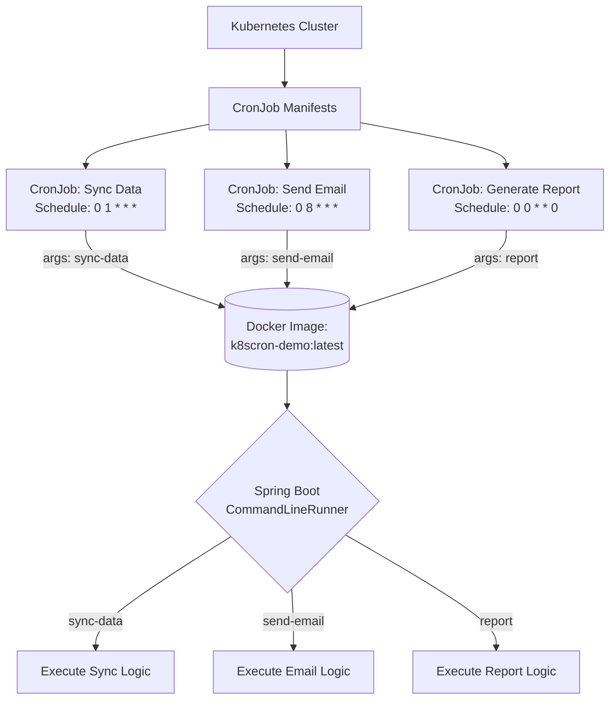

## The Background

When building enterprise systems, you often need scheduled background tasks such as data synchronization, report generation, email delivery, or database cleanup.

In a modern Kubernetes ecosystem, the native way to handle these scheduled tasks is by using the `CronJob` resource. However, a common architectural dilemma arises when deciding how to structure the application code for these jobs. 

If you have dozens of different scheduled tasks, creating dozens of separate Spring Boot projects and dozens of separate Docker images quickly becomes a maintenance nightmare. This "one image per job" approach leads to:
*   **Bloated CI/CD Pipelines:** Every minor change requires building, pushing, and deploying multiple independent images.
*   **Code Duplication:** Shared utilities, database repositories, and configuration classes must be duplicated or extracted into a shared library, adding complexity.
*   **Resource Inefficiency:** Managing dozens of repositories for small, single-purpose scripts is overkill.

Rather than fragmenting the codebase, one practical strategy is to build a single Spring Boot application that acts as a "Cron Runner" (a consolidated project containing all the cron job logic) and use **argument-based routing** at the Kubernetes level to determine which job executes.

This case study breaks down a Proof of Concept (PoC) demonstrating how to run a single Spring Boot application as multiple distinct Kubernetes CronJobs.

### Why Not Spring's `@Scheduled`?

A common question is: *Why use Kubernetes CronJobs at all? Why not just use Spring Boot's built-in `@Scheduled` annotation and let the application run continuously?*

The problem with in-memory scheduling emerges when you scale your application. If you deploy three replicas of your application to handle web traffic, all three replicas will independently trigger the `@Scheduled` method at the exact same time. This leads to duplicate data processing, race conditions, and potentially corrupted records.

While you can solve this using distributed locking libraries like ShedLock or Quartz (which rely on a shared database table to manage locks), it adds unnecessary complexity to your stack. By moving scheduling out of the application entirely (letting Kubernetes trigger a fresh, isolated Pod per run instead of relying on an in-memory `@Scheduled` method), the duplicate-trigger problem from replica scaling is eliminated by design, not by coordination. While Kubernetes CronJobs don't provide an absolute exactly-once guarantee (jobs should ideally be idempotent), they effectively solve this scaling issue without requiring complex distributed locking logic or persistent database connections just for scheduling.

## The Architecture: Single Image, Multiple Jobs

To solve the maintenance problem, we can decouple the application logic from the scheduling mechanism. Kubernetes handles the scheduling, while Spring Boot acts merely as an execution router.



By passing an argument from the Kubernetes manifest to the Docker container, the Spring Boot application knows exactly which subset of its code to execute before gracefully shutting down.

## The Spring Boot Implementation

Because these are transient tasks rather than long-running APIs, the Spring Boot application must be configured as a non-web application. This ensures it boots up quickly, runs the job, and shuts down immediately without starting an embedded Tomcat server.

In `application.properties`:
```properties
spring.main.web-application-type=none
```

### The Command Line Runner

The core of the routing mechanism relies on implementing Spring's `CommandLineRunner`. When the application starts, this interface provides access to the arguments passed via the Docker container's command line. It is crucial to use `CommandLineRunner` (or `ApplicationRunner`) rather than parsing arguments directly in the standard `public static void main` method. In a real-world scenario, your job logic will almost certainly need to call other Spring components (like JPA repositories or API clients). The `CommandLineRunner` is executed only *after* the entire Spring Application Context has been fully initialized, ensuring all your beans are ready to use. This also allows Spring Boot features such as dependency injection, transactions, configuration properties, and logging to be fully initialized before any business logic starts.

For this Proof of Concept, the conceptual job names from the diagram are simplified to `job-10s`, `job-30s`, and `job-50s` to focus on the timing and routing mechanism rather than real business logic.

To make the routing system more scalable and allow us to add new cron jobs simply by creating new classes without modifying the existing runner code, we implement a dynamic **Job Registry**. We use a custom annotation (`@RegistryKey`) and a common interface (`JobPerformable`) to automatically discover and map jobs.

If your runner only handles two or three simple tasks, a straightforward `switch` statement is often the best choice. It keeps the setup simple without the overhead of custom annotations and interfaces. However, as the number of jobs grows, the registry pattern is much cleaner because it prevents a single runner class from bloating with unrelated business dependencies and imports.

### The Job Interface and Registry

Each job implements `JobPerformable` and is annotated with its unique identifier key:

```java
public interface JobPerformable {
    void perform(String... args) throws Exception;
}

@Component
@RegistryKey(key = "job-10s")
public class Job10sPerformable implements JobPerformable {
    @Override
    public void perform(String... args) throws Exception {
        System.out.println("[JOB-10S] Executing business logic...");
    }
}
```

The `JobRegistry` dynamically collects all beans implementing `JobPerformable` at startup and builds the routing map:

```java
@Component
public class JobRegistry {
    private final Map<String, JobPerformable> registry = new HashMap<>();

    public JobRegistry(List<JobPerformable> jobs) {
        for (JobPerformable job : jobs) {
            RegistryKey annotation = AnnotationUtils.findAnnotation(job.getClass(), RegistryKey.class);
            if (annotation != null) {
                registry.put(annotation.key(), job);
            }
        }
    }

    public Optional<JobPerformable> getJob(String key) {
        return Optional.ofNullable(registry.get(key));
    }
}
```

### The Command Line Runner Implementation

The runner (`TaskRunner`) resolves the job from the registry using the first CLI argument and executes it, forwarding the remaining arguments:

```java
@Component
public class TaskRunner implements CommandLineRunner {
    private final JobRegistry jobRegistry;

    public TaskRunner(JobRegistry jobRegistry) {
        this.jobRegistry = jobRegistry;
    }

    @Override
    public void run(String... args) throws Exception {
        if (args.length == 0) {
            throw new IllegalArgumentException("No job name provided as argument!");
        }

        String jobName = args[0];
        JobPerformable job = jobRegistry.getJob(jobName)
                .orElseThrow(() -> new IllegalArgumentException("Unknown job '" + jobName + "'!"));

        // Pass remaining arguments to the job
        String[] jobArgs = new String[args.length - 1];
        System.arraycopy(args, 1, jobArgs, 0, jobArgs.length);

        job.perform(jobArgs);
    }
}
```

Notice that we let the application terminate naturally on success and throw an exception on failure, rather than using `System.exit()`. This is a Spring Boot best practice. Any uncaught exception propagates to Spring Boot and results in a non-zero process exit code. Kubernetes relies on the container's exit code to determine if the Pod succeeded or failed, ensuring Kubernetes correctly marks the job as `Failed`.

If your application uses connection pools or libraries that spawn non-daemon background threads, the JVM might hang instead of terminating naturally when `run()` finishes. If you encounter this, avoid the abrupt `System.exit(0)`. Instead, inject the `ApplicationContext` and use `SpringApplication.exit(context, () -> 0);` to gracefully shut down the Spring context and release all resources.

## The Kubernetes Implementation

On the infrastructure side, we deploy multiple `CronJob` definitions to the cluster. All of them point to the exact same Docker image (`k8scron-demo:latest`), but they override the `args` array to specify their unique identifier.

Kubernetes CronJobs use standard cron syntax, so the minimum scheduling interval is one minute. To demonstrate multiple executions within the same minute, this PoC intentionally offsets each job using `sleep`. In production, this delay is unnecessary and should be removed.

Here is an example of how the identical image is reused across different scheduled intervals:

```yaml
apiVersion: batch/v1
kind: CronJob
metadata:
  name: cronjob-10s
spec:
  schedule: "* * * * *"
  jobTemplate:
    spec:
      template:
        spec:
          containers:
          - name: cron-runner
            image: k8scron-demo:latest
            imagePullPolicy: Always
            command: ["/bin/sh", "-c"]
            args: ["sleep 10 && java -jar /app/app.jar job-10s"]
          restartPolicy: Never
---
apiVersion: batch/v1
kind: CronJob
metadata:
  name: cronjob-30s
spec:
  schedule: "* * * * *"
  jobTemplate:
    spec:
      template:
        spec:
          containers:
          - name: cron-runner
            image: k8scron-demo:latest
            imagePullPolicy: Always
            command: ["/bin/sh", "-c"]
            args: ["sleep 30 && java -jar /app/app.jar job-30s"]
          restartPolicy: Never
```

If you deploy these resources and inspect your cluster, you can verify that all jobs are running independently while utilizing the exact same image:

```bash
$ microk8s kubectl get cronjob
NAME          SCHEDULE    TIMEZONE   SUSPEND   ACTIVE   LAST SCHEDULE   AGE
cronjob-10s   * * * * *   <none>     False     1        59s             101s
cronjob-30s   * * * * *   <none>     False     1        59s             101s
cronjob-50s   * * * * *   <none>     False     1        59s             101s

$ microk8s kubectl describe cronjob cronjob-10s | grep Image
    Image:      k8scron-demo:latest

$ microk8s kubectl describe cronjob cronjob-30s | grep Image
    Image:      k8scron-demo:latest

$ microk8s kubectl describe cronjob cronjob-50s | grep Image
    Image:      k8scron-demo:latest
```

This simple verification demonstrates the architecture in practice: multiple independent CronJobs reusing the same application image.

## The Benefits of This Architecture

Consolidating background jobs into a single image offers several strategic advantages for engineering teams:

1.  **A Single CI/CD Pipeline:** You only need to maintain one Docker build pipeline. Whenever the code for any job is updated, a single image is pushed to the registry. Future executions will use the updated image once the CronJob references the new image tag (or automatically pulls the latest image if the configured image pull policy is `Always`).
2.  **Maximized Code Reuse:** Because all jobs live in the same repository, they can easily share data models, JPA repositories, third-party API clients, and configuration properties without the overhead of publishing internal Maven dependencies.
3.  **Centralized but Isolated Management:** While the codebase is monolithic, the execution environment remains isolated. In Kubernetes, `cronjob-10s` and `cronjob-30s` appear as completely separate resources. They have independent logs, independent failure metrics, and their schedules can be scaled or modified independently.

## Scaling Further: Grouping by Domain

While a single consolidated image works perfectly for a handful of scheduled tasks, as your system grows, cramming dozens of unrelated jobs into one Spring Boot application can lead to bloat. If you have a large number of jobs, loading all dependencies, entity classes, and configurations just to run a single lightweight task becomes inefficient. 

In practice, when dealing with many jobs, it is often better to group them by business domain into a few separate "Cron Runner" applications. For example:

```text
Email Runner
 ├── send-email
 ├── retry-email
 └── cleanup-email

Order Runner
 ├── sync-order
 ├── reconcile-payment
 └── expire-cart

Reporting Runner
 ├── daily-report
 ├── weekly-report
 └── analytics
```

This approach strikes a healthy balance: it prevents the "micro-repo" sprawl of creating one repository per job, while also avoiding the heavy startup times and dependency conflicts of a massive monolith.

There is no universal threshold for splitting runners. The decision usually depends on startup time, dependency footprint, deployment ownership, and operational complexity rather than the number of jobs alone.

## When This Approach is NOT a Good Fit

While powerful, this architecture is less suitable when:
*   Jobs require completely different runtime environments.
*   Teams deploy jobs independently (different deployment lifecycles).
*   Individual jobs have significantly different dependency footprints (e.g., one job needs heavy ML libraries, another needs lightweight API clients).
*   Jobs need different Java versions or base Docker images.

## Final Thoughts

Many scheduled workloads can be implemented without introducing additional scheduling frameworks or distributed locking mechanisms. By combining the scheduling power of Kubernetes with the argument-parsing capabilities of Spring Boot's `CommandLineRunner`, you can achieve a highly scalable, easy-to-maintain job execution platform using standard, out-of-the-box tools.

## Repository

This article is based on a Proof of Concept. You can view the full implementation on GitHub:
[https://github.com/adiputera/k8s-cronjob-spring-boot-demo](https://github.com/adiputera/k8s-cronjob-spring-boot-demo)
