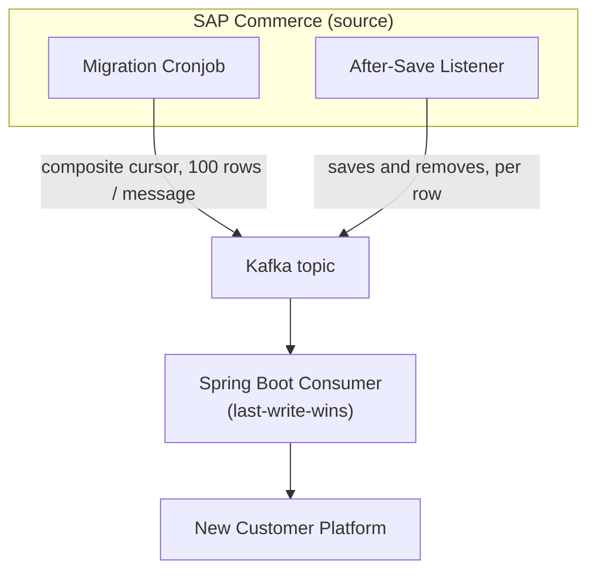

> **Scope:** This is the skeleton design - the producer/consumer/Kafka shape and the reconciliation logic. It is not the full implementation plan.

## The Background

A platform modernization needs to move customer records out of an existing SAP Commerce platform and into a new Spring Boot service. On paper this is the textbook three-step: export, transform, import. In practice the source is busy. People are registering, editing profiles, and placing orders the whole time, and the business isn't prepared to take the storefront offline for a migration window.

That last constraint is what makes it interesting. A snapshot taken today and applied to the target three days later is a stale snapshot. If you load it naively, it clobbers writes that already happened on the target in the meantime. So the migration can't really be a migration. It has to be a continuously-running sync that just happens to start with the back-catalogue.

## The Constraints

What I'm working with:

- Roughly 9 million customer rows on the source.
- Live traffic the whole way through - registrations, profile edits, transactions.
- No downtime. The source has to keep serving end users until the final cutover.
- No "big bang" export against the live cluster. A `SELECT *` on a 9M-row table is the kind of query that takes a node out, and the cluster is serving live customer traffic the whole time.
- Resumable. The job has to survive restarts, deploys, and weekend gaps without losing its place.
- Idempotent on the target. Out-of-order events are a question of *when*, not *if*.

## Why Not a Bulk Export

The instinct is to dump the table and reload it on the other side. I talked myself out of it pretty quickly.

A direct export on the production SAP Commerce cluster competes with the live workload for database, memory, and connection pool. Even with chunking, a long-running query against the customer table risks locking, slow plans, or just dragging down ordinary requests. Worse, the dataset is moving while you read it. By the time the export finishes, parts of it are already stale - and you have no mechanism to catch up that doesn't look exactly like the migration itself.

So I'm dropping the snapshot-and-import model. The migration becomes a streaming sync that runs for days.

## The Shape



Three pieces, joined by Kafka:

- **The cronjob** runs inside SAP Commerce and handles the back-catalogue. On each iteration it pulls up to 100 rows from the source customer table via a composite cursor, converts them into DTOs, packs the whole page into a single Kafka message as a batch, updates the cursor on its own cronjob model, and loops until a page returns fewer than 100 rows.
- **The listener** is an after-save listener on `Customer`. It fires once the row is persisted or removed and publishes a one-row DTO to the same Kafka topic. Saves and tombstones both flow through it. Mechanics in *How Live Updates Reach Kafka* below.
- **The consumer** is a Spring Boot service that subscribes to the topic, unpacks each message, applies last-write-wins reconciliation per row, and writes into the new platform's store.

Both source-side pieces live inside SAP Commerce, so they reuse the same authenticated DB access the platform already has - no extra credentials or network paths to manage.

The 100-rows-per-message batching is deliberate. At 9M rows, one Kafka message per row would put 9M messages on the topic - more broker bookkeeping than the migration needs. One message per 100-row page collapses that to ~90,000 messages while keeping individual messages well under typical broker limits.

Kafka in the middle does three things at once: it absorbs producer/consumer speed mismatch, it gives the consumer an offset to restart from, and it lets me scale consumer pods independently without coordinating with the source side. None of that is novel - it's just what Kafka is good at. But it's the difference between "one fragile job" and "independent pieces that retry their own failures."

The same topic carries three kinds of event: batches from the cronjob, one-row save events from the listener, and one-row tombstones from the listener on remove. From the consumer's perspective, they're variations of the same shape - one or more customer DTOs with `hybrisPk`, `modifiedTime`, and `deleted`. Saves also carry `customerId`; tombstones don't, because the row is gone by the time the listener fires. `hybrisPk` is the SAP Commerce row PK and the migration correlation key the consumer joins on; `customerId` is the business identifier (uid/email) the downstream platform cares about.

Although the example here is SAP Commerce, the pattern is not. This article focuses on the customer table because it's the largest and the one most exposed to live writes. The same shape applies to other source tables - a separate cronjob with its own composite cursor and cronjob model, the same kind of after-save listener on the corresponding item type, all feeding Kafka. The logic doesn't change; only the DTO and the item type do.

## How Live Updates Reach Kafka

The cronjob handles the back-catalogue. The live half needs its own path, because SAP Commerce doesn't publish to Kafka on its own. The cleanest place to hook in is the platform's own save lifecycle.

An `AfterSaveListener` is registered for the `Customer` item type. SAP Commerce invokes it after every save *and* every remove on the row. The listener inspects the event type, builds the appropriate DTO, and publishes it to the same Kafka topic. From the consumer's perspective, a live event is indistinguishable from a cronjob batch except for size - typically one row instead of a hundred. Every event carries `hybrisPk`, `modifiedTime`, and `deleted`. Saves also carry `customerId`; tombstones don't (see *Deletes*).

The choice of *after-save* over a `PrepareInterceptor` or `ValidateInterceptor` matters here. Interceptors fire *before* the save commits, so if validation rejects the model or the transaction rolls back, an interceptor would still have already published an event for a write that never landed. The after-save listener only fires when the change is actually on disk - for a save, the row is persisted; for a remove, the row is gone - which keeps the Kafka stream aligned with the source's real state.

### Deployment

The listener and the cronjob are part of the same SAP Commerce deployment - they go live together. The cronjob doesn't auto-start; it's manually triggered once the deployment is finished. By the time it's kicked off, the listener has almost certainly already fired on a few saves or removes, since live traffic doesn't pause for deployments. There's no separate "turn on live stream, then turn on back-catalogue" phasing to coordinate.

What does need to be sequenced earlier is the **consumer** (see *Running the Consumer Early* below) - it has to be running well before the cutover date so the back-catalogue has time to drain.

## Pagination: Why `pk > ?lastPk` Doesn't Work

The first cut of the cursor would be the obvious one:

```sql
WHERE {pk} > ?lastPk
ORDER BY {pk}
LIMIT 100
```

This works on a lot of systems. It does not work on SAP Commerce.

The platform's `PK` (the same value we put on the DTO as `hybrisPk`) is a 64-bit composite (type code + counter), and the counter isn't strictly monotonic with creation time. Sampling real data on the source makes that obvious:

| PK | Creation Time |
|---|---|
| 8796422045700 | 2019-01-14 |
| 8796421521412 | 2019-01-16 |

The older row has the *larger* PK. So a `pk > ?lastPk` walk doesn't visit rows in creation order, and any cursor that depends on creation order being implied by PK order can skip rows.

The design uses a composite cursor on `(creationtime, pk)`:

```sql
WHERE
    {creationtime} > ?lastCreationTime
    OR (
        {creationtime} = ?lastCreationTime
        AND {pk} > ?lastPk
    )
ORDER BY {creationtime} ASC, {pk} ASC
LIMIT 100
```

The cronjob persists `(lastCreationTime, lastPk)` on its own cronjob model after every successful page. That gives a deterministic walk with a tiebreaker for rows sharing a timestamp, and it survives restarts cleanly - the next run picks up exactly where the previous one left off, with no risk of double-publishing the boundary page or skipping it. The job loops on the cursor until a page returns fewer than 100 rows, at which point the back-catalogue is drained and only the listener stream is left running.

The composite-cursor pattern is standard keyset pagination. The lesson worth pulling out is specific: assumptions about PK ordering don't survive contact with production data, and the cheapest way to find that out is to actually look at it before writing the cursor.

## The Cronjob Loop

The full loop on top of that cursor is short:

```java
public void migrate(MigrationCronjobModel cronjob) {
    Date lastCreationTime = cronjob.getLastCreationTime();
    if (lastCreationTime == null) {
        lastCreationTime = new Date(0);   // 1970-01-01
    }

    Long lastPk = cronjob.getLastPk();
    if (lastPk == null) {
        lastPk = 0L;
    }

    boolean done = false;

    while (!done) {
        FlexibleSearchQuery query = new FlexibleSearchQuery(
            "SELECT {pk} FROM {Customer} " +
            "WHERE {creationtime} > ?lastCreationTime " +
            "   OR ({creationtime} = ?lastCreationTime AND {pk} > ?lastPk) " +
            "ORDER BY {creationtime} ASC, {pk} ASC"
        );
        query.addQueryParameter("lastCreationTime", lastCreationTime);
        query.addQueryParameter("lastPk", lastPk);
        query.setCount(100);

        List<CustomerModel> page = flexibleSearchService.search(query).getResult();

        if (page.isEmpty()) {
            done = true;
            break;
        }

        List<CustomerDto> batch = new ArrayList<>(page.size());
        for (CustomerModel customer : page) {
            batch.add(toDto(customer));
            lastCreationTime = customer.getCreationtime();
            lastPk = customer.getPk();
        }

        kafkaPublisher.publish(batch);   // one Kafka message per page

        cronjob.setLastCreationTime(lastCreationTime);
        cronjob.setLastPk(lastPk);
        modelService.save(cronjob);

        if (page.size() < 100) {
            done = true;   // partial page: back-catalogue drained, listener handles the rest
        }
    }
}
```

Three details worth naming:

- The composite cursor (`lastCreationTime`, `lastPk`) is updated *per row* as the batch is built, but persisted to the cronjob model *after* the publish. If the job dies between `kafkaPublisher.publish(batch)` and `modelService.save(cronjob)`, the next run re-publishes the same page. LWW absorbs the duplicates on the consumer side, so the cost is a small redundant batch, not a correctness bug.
- The loop has two termination conditions, both meaning the back-catalogue is drained: an empty page (`size() == 0`, ending the loop before publishing) and a partial page (`size() < 100`, ending it after publishing the partial). Anything beyond the cursor at that point is either already on Kafka via the listener (created during the cronjob's run) or will be when the listener fires.
- On a fresh cronjob model both `lastCreationTime` and `lastPk` are null, so the code defaults them to `1970-01-01` and `0` at the top of the method. The cursor starts from the floor on first run; every later run reads the persisted values.

## What I'm Deliberately Not Doing: an `isMigrated` Flag

The other classic approach is to add an `isMigrated` column on the source customer table and flip it as rows go through. I considered it and dropped it.

Adding a column to a 9M-row table on the live SAP Commerce platform means a write on every row, index maintenance, more transaction load, and a schema change that has to ship through the same release pipeline as the rest of the platform. For a one-off migration job, that's a lot of cost on the source side just to track progress. The composite cursor stored on the *job* side gives me the same resumability without touching the source schema.

The general rule: the migration job should leave as small a footprint on the source as possible. Reads are fine. Writes stay in the schema after the migration ends, even though they're only useful while it's running.

## Conflict Resolution: Last-Write-Wins

The harder part isn't pagination. It's what happens when a customer is touched *while* the migration is running.

Picture this sequence:

1. The customer updates their profile today. The source emits an update event onto Kafka immediately.
2. The consumer applies it on the new platform. The customer now exists on the target, with today's data.
3. Three days later, the back-catalogue cursor finally reaches that customer's row. The cronjob publishes a snapshot event for it. The snapshot is *older* than what's already on the target.

If the consumer naively applies the snapshot, it overwrites the more recent update with stale data. This is the failure mode the design is built around.

The fix is to give up on global ordering entirely and rely on the timestamp instead. Every event - whether it came from the cursor, a live save, or a remove - carries the row's `modifiedTime`. The consumer applies a simple rule:

```java
@Transactional
void apply(CustomerEvent incoming) {
    Customer existing = repo.findByHybrisPk(incoming.hybrisPk).orElse(null);

    if (existing == null) {
        // First time we've seen this hybrisPk. If the event is a tombstone,
        // we still insert (deleted = true) - that's the race case.
        repo.save(toEntity(incoming));
        return;
    }

    if (existing.isDeleted()) {
        // Absorbing: once deleted, always deleted.
        return;
    }

    if (!incoming.modifiedTime.isAfter(existing.modifiedTime)) {
        // Older or equal - drop it.
        return;
    }

    existing.applyFrom(incoming);  // merge: overwrites the fields the DTO carries (deleted included)
    repo.save(existing);
}
```

Four branches in priority order: first-time-insert, absorbing-tombstone, stale-event-drop, fresh-event-apply. The order matters - the absorbing check has to come before the timestamp check, otherwise a newer event would un-delete a tombstoned customer.

`applyFrom` is merge-style: it overwrites the fields the incoming DTO carries and leaves the rest alone. That matters for tombstones, which only carry `hybrisPk`, `modifiedTime`, and `deleted = true`. Applying a tombstone to a live row flips `deleted` and bumps `modifiedTime` without touching `customerId` or any other column.

Concurrency between consumer threads comes for free from JPA. A `@Version` field on `Customer` turns conflicting updates into `OptimisticLockException`. Concurrent first-time inserts (two threads both seeing `existing == null` and both calling `save`) surface as `DataIntegrityViolationException` on the unique constraint. The consumer catches both and re-runs `apply()` against the row's new state. By the time the retry reads `existing`, the winning event is already on disk and the four branches land on the right answer.

Anything the consumer can't handle (a DTO that fails to deserialize, a downstream constraint the four branches don't anticipate, an I/O failure that outlives its retry budget) is written into a `failed_migration` table instead of being dropped or blocking the topic. Each row captures the raw event payload, `hybrisPk`, the exception class and message, and a timestamp, so the bad event is preserved for manual inspection later while the consumer keeps moving on the rest of the stream.

Three properties fall out of this:

- **Stale snapshots are safe.** The day-three snapshot above gets dropped because its `modifiedTime` is older than what's already on the target.
- **Duplicates are safe.** Kafka is at-least-once. A re-delivered event compares equal-or-older to the row already on the target and is ignored.
- **Out-of-order delivery is safe.** If event B arrives before event A but B is newer, B wins, and A is dropped when it arrives later.

"Newest wins" makes ordering irrelevant as long as the timestamp is accurate. It pushes almost all the complexity out of the consumer.

For saves and updates, that accuracy is free: SAP Commerce stamps `modifiedtime` on every item type. Tombstones get a listener-stamped `now` instead (see *Deletes*); that wrinkle is the one place the timestamp story leans on a non-DB clock.

## The Idempotency Contract

Once last-write-wins is in place, idempotency is almost free, but it's worth being explicit about what the consumer guarantees:

- Replaying the same event N times converges to the same target state as replaying it once.
- A strictly older event never overwrites a strictly newer one.
- A retry from Kafka is indistinguishable from the original delivery.
- The first tombstone for a row is always applied, and a deleted row stays deleted.

These four lines are basically the consumer's whole contract. Everything else - error handling, retries, dead-lettering - just feeds back into them.

## Deletes

`AfterSaveListener` covers removes as well as saves, but with one quirk: when it fires for a remove, the row is already gone, so the model can't be loaded. Only the PK is exposed on the event.

That's the reason every event on the topic carries `hybrisPk`. For a save, `hybrisPk` is read from the persisted row alongside the rest of the fields. For a remove, it's the only thing the listener has, and the tombstone DTO is just `hybrisPk`, `modifiedTime` (the listener's `now` at fire time), and `deleted: true`. The row's real `modifiedtime` would be the more honest stamp, but it's gone with the row. The listener's clock is close enough in practice: the listener fires post-commit, so `now` lands after the delete and after any prior DB-stamped `modifiedtime` on that row, assuming JVM and DB clocks aren't wildly out of sync.

### The absorbing rule

On the target side, the consumer treats tombstones as absorbing. Once `deleted = true` lands for a `hybrisPk`, that row stays deleted for the lifetime of the PK. Any later event for the same `hybrisPk` is dropped, regardless of timestamp.

That rule is safe here because SAP Commerce's PK counter doesn't recycle. A deleted customer's `hybrisPk` is never reused for a new customer. On a source where PKs could be reissued, the same rule would silently swallow legitimate re-registrations, and you'd want plain LWW on the `deleted` field instead.

### The race case

The back-catalogue cursor and the tombstone path can publish events for the same customer in any order. The interesting case is when the tombstone reaches the consumer *before* the snapshot does, and the customer doesn't exist on the target yet.

The consumer inserts the row anyway, with `deleted = true`. The target requires `customerId` NOT NULL on every row, but the tombstone has nothing to put there: by the time the after-save listener fires, the source row is gone and the only field SAP Commerce exposes on the event is the PK. So the race-case insert satisfies the constraint by writing `hybrisPk` into `customerId` as a placeholder. The row is permanently tombstoned and the absorbing rule guarantees nothing ever reads it, so the placeholder is invisible to anything else.

That way when the stale snapshot arrives behind it, the absorbing rule kicks in and drops the snapshot. The alternative (no-op on a tombstone for an unknown `hybrisPk`) would let the late snapshot create the customer as a live record, which is exactly the bug the tombstone exists to prevent.

This race case is the reason the Idempotency Contract carries a tombstone bullet at all.

## Running the Consumer Early

The decision that matters most operationally is deploying the consumer *long* before the cutover date.

At cursor pace, the back-catalogue takes days to finish - the exact number depends on cronjob batch size, Kafka throughput, and how hard I'm willing to push the source. If the consumer only goes live in the cutover window, the migration is either incomplete at flip time, or the window has to be big enough that "zero downtime" becomes a polite fiction.

So the plan is to put the consumer into production weeks ahead. The back-catalogue runs in the background. Live update events flow alongside it. By the time cutover arrives, the bulk of the data is already on the target, the delta of in-flight updates has been continuously narrowing, and the actual "switch" is a routing change rather than a data move.

A few things this should buy:

- **Smaller cutover scope.** Most of the data will already be verified. The cutover is about traffic, not bytes.
- **Validation time.** I can compare row counts, sample-check fields, and tune throughput against real data well before it matters.
- **A real rollback story.** Because the target has been ingesting for weeks, falling back is a routing change, not a data restore.

The framing I keep coming back to: the pipeline isn't a migration, it's a long-running sync bridge that we eventually unplug from the source.

## Open Questions

A few things I want to validate once the design moves into implementation:

- **Cronjob pace under live load.** The cursor query is cheap per page, but 9M rows is 90,000 pages at 100 rows each. I want to measure how much the source's database actually notices before settling on a target throughput.
- **Batch size and Kafka message limits.** 100 rows per message is comfortably under the broker's default `max.message.bytes`, but worth measuring against the actual DTO size before committing.
- **Timestamp resolution.** SAP Commerce's `modifiedtime` is millisecond-resolution. If two updates land in the same millisecond, last-write-wins becomes "either-write-wins." I expect this to be vanishingly rare in practice, but I want to verify it isn't a real failure mode before relying on it.
- **Index on `(creationtime, pk)`.** The cursor needs this index to perform. In SAP Commerce that's an `*-items.xml` change; the platform creates the index during the next system update.

## What I'm Watching For

Going in, these are the things I expect to bite:

- **Consumer-side bugs.** It's the half that has to be idempotent, order-tolerant, and restart-safe. Most of the bugs will live here.
- **Early consumer deploy as the operational lever.** Days of background sync turn cutover from an event into a non-event - that's the property the whole design hangs on.

## Final Thoughts

What changes the mental model on this design is giving up on the idea of a "migration window" at all. Once you treat the source as a long-running event stream and the target as an eventually-consistent reader, most of the hard parts - ordering, retries, in-flight updates, rollback - either disappear or collapse into the same problem (`modifiedTime` wins).

The pipeline isn't particularly clever in any single component. Composite-cursor pagination is standard, Kafka is standard, last-write-wins is standard. What makes it work is deciding which problems to push onto the consumer (idempotency, conflict resolution) and which to keep off the source (writes, locks, schema changes). Once those lines are drawn, the rest mostly falls out.
